# Step 17: Performance

[//]: # (head-end)


In this part of the tutorial we're going to do a bit different work than in previous chapters. We'll analyze the code instead of writing it, including both the API and the web application.

## API Performance

First, let's start with the GraphQL API.

### Finding bottlenecks

In order to implement fixes and do improvements we need to understand which part of the API needs help. There's still not many tools around GraphQL in terms of analytics and inspection but there's one highly useful, it's called **Apollo Engine**.

Since we're going to use it, you need to register an account at [engine.apollographql.com](https://engine.apollographql.com/) and create a service. Please then follow [the "How to configure an Apollo project" instructions](https://www.apollographql.com/docs/platform/schema-registry/#using-the-schema-registry).

Once you're ready, please start the server and run this command:

    $ apollo service:push

To collect the data, let's play with the client app for some time. After that, go to Engine's website.

Here's one of graphs with timing of an operation. We can understand when each resolver takes place and how much time it consumes. Some resolvers happen in parallel.
The `< 1ms` says it was a very simple computation or an element resolved immediately.

We find it very useful to understand how operation behaves.

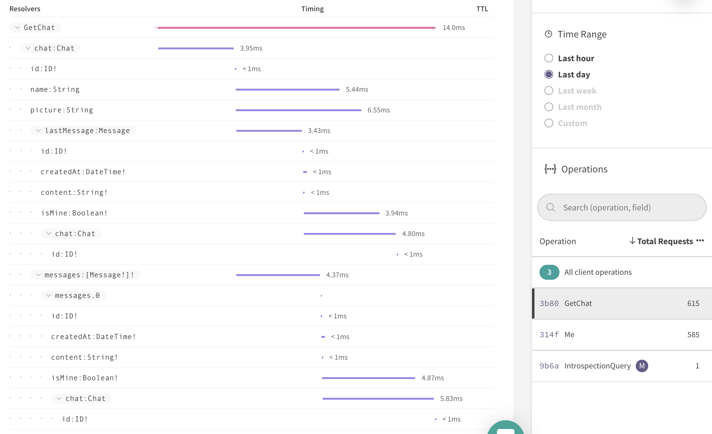

Let's go through an entire query to find fields fetched multiple times. The most obvious field is `isMine`. We see it's computed twice for almost 4 and 5 milliseconds.
In order to find out what does it mean, we need to look at the code. The resolver gets the currently logged in user from the `Auth` service and its `currentUser`. Each time the method is invoked, a query to PostgreSQL is made. We ask for that data multiple times, once in `lastMessage` and also in every message from the list.

We could deduplicate the SQL queries! In order to do that the most obvious library that pops to my mind is Dataloader.

Let's install the package and discuss it afterwards:

    npm install dataloader

The Dataloader is a library created and maintained by Facebook. It's main purpose is to turn equivalent requests into a single execution. Sounds like a perfect solution, right? It actually is.

A short explaination of how Dataloader works.

```ts
async function fetchUser(id: number): Promise<User> {
  // Resolves asynchronously, after less than 1s.
  return db.users.findOne(id);
}

async function fetchUsers(ids: number[]): Promise<User[]> {
  const users = ids.map(id => fetchUser(id));
  return Promise.all(users);
}

const loader = new Dataloader(keys => fetchUsers(keys));

async function main() {
  const user1 = await loader.load(1);
  const user2 = await loader.load(2);

  // Later on user #1 is fetched again.
  // It resolves immediately.
  const member1 = await loader.load(1);
}
```

Think of the Dataloader as a class that has a `Map` object in it, its keys are of course unique and each value is a `Promise`.
Every time you ask for something, Dataloader looks for it in the `Map`. When there's already something, the `Promise` is returned but if there's none the provided function is invoked and a new `Promise` is created. This way equivalent requests share the same `Promise`.

> It's important to know that the `Map` object grows until the DataLoader is released, that's why it's recommended to keep `Dataloader` in GraphQL's context.

Let's implement `Dataloader` in our `Database` service:

[{]: <helper> (diffStep "14.1" files="modules/common/database.provider.ts" module="server")

#### [__Server__ Step 14.1: Deduplicate SQL queries](https://github.com/Urigo/WhatsApp-Clone-Server/commit/7c7737e11436167df8caa28644ec46c0ba97042e)

##### Changed modules&#x2F;common&#x2F;database.provider.ts
```diff
@@ -1,14 +1,41 @@
 ┊ 1┊ 1┊import { Injectable, ProviderScope } from '@graphql-modules/di';
 ┊ 2┊ 2┊import { OnResponse } from '@graphql-modules/core';
-┊ 3┊  ┊import { Pool, PoolClient } from 'pg';
+┊  ┊ 3┊import { Pool, PoolClient, QueryResult } from 'pg';
+┊  ┊ 4┊import { SQLStatement } from 'sql-template-strings';
+┊  ┊ 5┊import Dataloader from 'dataloader';
 ┊ 4┊ 6┊
 ┊ 5┊ 7┊@Injectable({
 ┊ 6┊ 8┊  scope: ProviderScope.Session,
 ┊ 7┊ 9┊})
 ┊ 8┊10┊export class Database implements OnResponse {
 ┊ 9┊11┊  private instance: PoolClient;
+┊  ┊12┊  private loader: Dataloader<string | SQLStatement, QueryResult>;
 ┊10┊13┊
-┊11┊  ┊  constructor(private pool: Pool) {}
+┊  ┊14┊  constructor(private pool: Pool) {
+┊  ┊15┊    this.loader = new Dataloader(
+┊  ┊16┊      queries =>
+┊  ┊17┊        Promise.all(
+┊  ┊18┊          queries.map(async query => {
+┊  ┊19┊            const db = await this.getClient();
+┊  ┊20┊            return db.query(query);
+┊  ┊21┊          })
+┊  ┊22┊        ),
+┊  ┊23┊      {
+┊  ┊24┊        cacheKeyFn: (key: string | SQLStatement) => {
+┊  ┊25┊          let id: string;
+┊  ┊26┊
+┊  ┊27┊          if (typeof key === 'string') {
+┊  ┊28┊            id = key;
+┊  ┊29┊          } else {
+┊  ┊30┊            id = key.text + ' - ' + JSON.stringify(key.values);
+┊  ┊31┊          }
+┊  ┊32┊
+┊  ┊33┊          return id;
+┊  ┊34┊        },
+┊  ┊35┊        batch: false,
+┊  ┊36┊      }
+┊  ┊37┊    );
+┊  ┊38┊  }
 ┊12┊39┊
 ┊13┊40┊  async onRequest() {
 ┊14┊41┊    this.instance = await this.pool.connect();
```
```diff
@@ -20,7 +47,11 @@
 ┊20┊47┊    }
 ┊21┊48┊  }
 ┊22┊49┊
-┊23┊  ┊  async getClient() {
+┊  ┊50┊  private getClient() {
 ┊24┊51┊    return this.instance;
 ┊25┊52┊  }
+┊  ┊53┊
+┊  ┊54┊  query(query: SQLStatement | string) {
+┊  ┊55┊    return this.loader.load(query);
+┊  ┊56┊  }
 ┊26┊57┊}
```

[}]: #

The key is created based on SQL statement and its values and we also turned off batching because it's important to execute SQL operations sequentially.
There's also a new method called `query`, to execute SQL statements through Dataloader. It also reduces a boilerplate of asking for db client and executing a query every time we do SQL in resolvers and providers.

Now we need to apply that change in all providers:

[{]: <helper> (diffStep "14.1" files="modules/users/users.provider.ts, modules/chats/chats.provider.ts" module="server")

#### [__Server__ Step 14.1: Deduplicate SQL queries](https://github.com/Urigo/WhatsApp-Clone-Server/commit/7c7737e11436167df8caa28644ec46c0ba97042e)

##### Changed modules&#x2F;chats&#x2F;chats.provider.ts
```diff
@@ -11,9 +11,7 @@
 ┊11┊11┊  @Inject() private pubsub: PubSub;
 ┊12┊12┊
 ┊13┊13┊  async findChatsByUser(userId: string) {
-┊14┊  ┊    const db = await this.db.getClient();
-┊15┊  ┊
-┊16┊  ┊    const { rows } = await db.query(sql`
+┊  ┊14┊    const { rows } = await this.db.query(sql`
 ┊17┊15┊      SELECT chats.* FROM chats, chats_users
 ┊18┊16┊      WHERE chats.id = chats_users.chat_id
 ┊19┊17┊      AND chats_users.user_id = ${userId}
```
```diff
@@ -23,8 +21,7 @@
 ┊23┊21┊  }
 ┊24┊22┊
 ┊25┊23┊  async findChatByUser({ chatId, userId }: { chatId: string; userId: string }) {
-┊26┊  ┊    const db = await this.db.getClient();
-┊27┊  ┊    const { rows } = await db.query(sql`
+┊  ┊24┊    const { rows } = await this.db.query(sql`
 ┊28┊25┊      SELECT chats.* FROM chats, chats_users
 ┊29┊26┊      WHERE chats_users.chat_id = ${chatId}
 ┊30┊27┊      AND chats.id = chats_users.chat_id
```
```diff
@@ -35,16 +32,14 @@
 ┊35┊32┊  }
 ┊36┊33┊
 ┊37┊34┊  async findChatById(chatId: string) {
-┊38┊  ┊    const db = await this.db.getClient();
-┊39┊  ┊    const { rows } = await db.query(sql`
+┊  ┊35┊    const { rows } = await this.db.query(sql`
 ┊40┊36┊      SELECT * FROM chats WHERE id = ${chatId}
 ┊41┊37┊    `);
 ┊42┊38┊    return rows[0] || null;
 ┊43┊39┊  }
 ┊44┊40┊
 ┊45┊41┊  async findMessagesByChat(chatId: string) {
-┊46┊  ┊    const db = await this.db.getClient();
-┊47┊  ┊    const { rows } = await db.query(
+┊  ┊42┊    const { rows } = await this.db.query(
 ┊48┊43┊      sql`SELECT * FROM messages WHERE chat_id = ${chatId}`
 ┊49┊44┊    );
 ┊50┊45┊
```
```diff
@@ -52,8 +47,7 @@
 ┊52┊47┊  }
 ┊53┊48┊
 ┊54┊49┊  async lastMessage(chatId: string) {
-┊55┊  ┊    const db = await this.db.getClient();
-┊56┊  ┊    const { rows } = await db.query(sql`
+┊  ┊50┊    const { rows } = await this.db.query(sql`
 ┊57┊51┊      SELECT * FROM messages
 ┊58┊52┊      WHERE chat_id = ${chatId}
 ┊59┊53┊      ORDER BY created_at DESC
```
```diff
@@ -64,8 +58,7 @@
 ┊64┊58┊  }
 ┊65┊59┊
 ┊66┊60┊  async firstRecipient({ chatId, userId }: { chatId: string; userId: string }) {
-┊67┊  ┊    const db = await this.db.getClient();
-┊68┊  ┊    const { rows } = await db.query(sql`
+┊  ┊61┊    const { rows } = await this.db.query(sql`
 ┊69┊62┊      SELECT users.* FROM users, chats_users
 ┊70┊63┊      WHERE users.id != ${userId}
 ┊71┊64┊      AND users.id = chats_users.user_id
```
```diff
@@ -76,8 +69,7 @@
 ┊76┊69┊  }
 ┊77┊70┊
 ┊78┊71┊  async participants(chatId: string) {
-┊79┊  ┊    const db = await this.db.getClient();
-┊80┊  ┊    const { rows } = await db.query(sql`
+┊  ┊72┊    const { rows } = await this.db.query(sql`
 ┊81┊73┊      SELECT users.* FROM users, chats_users
 ┊82┊74┊      WHERE chats_users.chat_id = ${chatId}
 ┊83┊75┊      AND chats_users.user_id = users.id
```
```diff
@@ -87,8 +79,7 @@
 ┊87┊79┊  }
 ┊88┊80┊
 ┊89┊81┊  async isParticipant({ chatId, userId }: { chatId: string; userId: string }) {
-┊90┊  ┊    const db = await this.db.getClient();
-┊91┊  ┊    const { rows } = await db.query(sql`
+┊  ┊82┊    const { rows } = await this.db.query(sql`
 ┊92┊83┊      SELECT * FROM chats_users
 ┊93┊84┊      WHERE chat_id = ${chatId}
 ┊94┊85┊      AND user_id = ${userId}
```
```diff
@@ -106,8 +97,7 @@
 ┊106┊ 97┊    userId: string;
 ┊107┊ 98┊    content: string;
 ┊108┊ 99┊  }) {
-┊109┊   ┊    const db = await this.db.getClient();
-┊110┊   ┊    const { rows } = await db.query(sql`
+┊   ┊100┊    const { rows } = await this.db.query(sql`
 ┊111┊101┊      INSERT INTO messages(chat_id, sender_user_id, content)
 ┊112┊102┊      VALUES(${chatId}, ${userId}, ${content})
 ┊113┊103┊      RETURNING *
```
```diff
@@ -129,8 +119,7 @@
 ┊129┊119┊    userId: string;
 ┊130┊120┊    recipientId: string;
 ┊131┊121┊  }) {
-┊132┊   ┊    const db = await this.db.getClient();
-┊133┊   ┊    const { rows } = await db.query(sql`
+┊   ┊122┊    const { rows } = await this.db.query(sql`
 ┊134┊123┊      SELECT chats.* FROM chats, (SELECT * FROM chats_users WHERE user_id = ${userId}) AS chats_of_current_user, chats_users
 ┊135┊124┊      WHERE chats_users.chat_id = chats_of_current_user.chat_id
 ┊136┊125┊      AND chats.id = chats_users.chat_id
```
```diff
@@ -143,9 +132,9 @@
 ┊143┊132┊    }
 ┊144┊133┊
 ┊145┊134┊    try {
-┊146┊   ┊      await db.query('BEGIN');
+┊   ┊135┊      await this.db.query('BEGIN');
 ┊147┊136┊
-┊148┊   ┊      const { rows } = await db.query(sql`
+┊   ┊137┊      const { rows } = await this.db.query(sql`
 ┊149┊138┊        INSERT INTO chats
 ┊150┊139┊        DEFAULT VALUES
 ┊151┊140┊        RETURNING *
```
```diff
@@ -153,17 +142,17 @@
 ┊153┊142┊
 ┊154┊143┊      const chatAdded = rows[0];
 ┊155┊144┊
-┊156┊   ┊      await db.query(sql`
+┊   ┊145┊      await this.db.query(sql`
 ┊157┊146┊        INSERT INTO chats_users(chat_id, user_id)
 ┊158┊147┊        VALUES(${chatAdded.id}, ${userId})
 ┊159┊148┊      `);
 ┊160┊149┊
-┊161┊   ┊      await db.query(sql`
+┊   ┊150┊      await this.db.query(sql`
 ┊162┊151┊        INSERT INTO chats_users(chat_id, user_id)
 ┊163┊152┊        VALUES(${chatAdded.id}, ${recipientId})
 ┊164┊153┊      `);
 ┊165┊154┊
-┊166┊   ┊      await db.query('COMMIT');
+┊   ┊155┊      await this.db.query('COMMIT');
 ┊167┊156┊
 ┊168┊157┊      this.pubsub.publish('chatAdded', {
 ┊169┊158┊        chatAdded,
```
```diff
@@ -171,18 +160,16 @@
 ┊171┊160┊
 ┊172┊161┊      return chatAdded;
 ┊173┊162┊    } catch (e) {
-┊174┊   ┊      await db.query('ROLLBACK');
+┊   ┊163┊      await this.db.query('ROLLBACK');
 ┊175┊164┊      throw e;
 ┊176┊165┊    }
 ┊177┊166┊  }
 ┊178┊167┊
 ┊179┊168┊  async removeChat({ chatId, userId }: { chatId: string; userId: string }) {
-┊180┊   ┊    const db = await this.db.getClient();
-┊181┊   ┊
 ┊182┊169┊    try {
-┊183┊   ┊      await db.query('BEGIN');
+┊   ┊170┊      await this.db.query('BEGIN');
 ┊184┊171┊
-┊185┊   ┊      const { rows } = await db.query(sql`
+┊   ┊172┊      const { rows } = await this.db.query(sql`
 ┊186┊173┊        SELECT chats.* FROM chats, chats_users
 ┊187┊174┊        WHERE id = ${chatId}
 ┊188┊175┊        AND chats.id = chats_users.chat_id
```
```diff
@@ -192,11 +179,11 @@
 ┊192┊179┊      const chat = rows[0];
 ┊193┊180┊
 ┊194┊181┊      if (!chat) {
-┊195┊   ┊        await db.query('ROLLBACK');
+┊   ┊182┊        await this.db.query('ROLLBACK');
 ┊196┊183┊        return null;
 ┊197┊184┊      }
 ┊198┊185┊
-┊199┊   ┊      await db.query(sql`
+┊   ┊186┊      await this.db.query(sql`
 ┊200┊187┊        DELETE FROM chats WHERE chats.id = ${chatId}
 ┊201┊188┊      `);
 ┊202┊189┊
```
```diff
@@ -205,11 +192,11 @@
 ┊205┊192┊        targetChat: chat,
 ┊206┊193┊      });
 ┊207┊194┊
-┊208┊   ┊      await db.query('COMMIT');
+┊   ┊195┊      await this.db.query('COMMIT');
 ┊209┊196┊
 ┊210┊197┊      return chatId;
 ┊211┊198┊    } catch (e) {
-┊212┊   ┊      await db.query('ROLLBACK');
+┊   ┊199┊      await this.db.query('ROLLBACK');
 ┊213┊200┊      throw e;
 ┊214┊201┊    }
 ┊215┊202┊  }
```

##### Changed modules&#x2F;users&#x2F;users.provider.ts
```diff
@@ -13,8 +13,7 @@
 ┊13┊13┊  @Inject() private db: Database;
 ┊14┊14┊
 ┊15┊15┊  async findById(userId: string) {
-┊16┊  ┊    const db = await this.db.getClient();
-┊17┊  ┊    const { rows } = await db.query(
+┊  ┊16┊    const { rows } = await this.db.query(
 ┊18┊17┊      sql`SELECT * FROM users WHERE id = ${userId}`
 ┊19┊18┊    );
 ┊20┊19┊
```
```diff
@@ -22,8 +21,7 @@
 ┊22┊21┊  }
 ┊23┊22┊
 ┊24┊23┊  async findAllExcept(userId: string) {
-┊25┊  ┊    const db = await this.db.getClient();
-┊26┊  ┊    const { rows } = await db.query(
+┊  ┊24┊    const { rows } = await this.db.query(
 ┊27┊25┊      sql`SELECT * FROM users WHERE id != ${userId}`
 ┊28┊26┊    );
 ┊29┊27┊
```
```diff
@@ -31,8 +29,7 @@
 ┊31┊29┊  }
 ┊32┊30┊
 ┊33┊31┊  async findByUsername(username: string) {
-┊34┊  ┊    const db = await this.db.getClient();
-┊35┊  ┊    const { rows } = await db.query(
+┊  ┊32┊    const { rows } = await this.db.query(
 ┊36┊33┊      sql`SELECT * FROM users WHERE username = ${username}`
 ┊37┊34┊    );
 ┊38┊35┊
```
```diff
@@ -48,9 +45,8 @@
 ┊48┊45┊    name: string;
 ┊49┊46┊    password: string;
 ┊50┊47┊  }) {
-┊51┊  ┊    const db = await this.db.getClient();
 ┊52┊48┊    const passwordHash = bcrypt.hashSync(password, bcrypt.genSaltSync(8));
-┊53┊  ┊    const createdUserQuery = await db.query(sql`
+┊  ┊49┊    const createdUserQuery = await this.db.query(sql`
 ┊54┊50┊        INSERT INTO users(password, picture, username, name)
 ┊55┊51┊        VALUES(${passwordHash}, ${DEFAULT_PROFILE_PIC}, ${username}, ${name})
 ┊56┊52┊        RETURNING *
```

[}]: #

Deduplication is done but the `currentUser` method does more than just that. It verifies the auth token extracted from a request's cookie. This could be avoided by an assignment to a private prop and a simple if statement.

[{]: <helper> (diffStep "14.2" module="server")

#### [__Server__ Step 14.2: Cache current user object](https://github.com/Urigo/WhatsApp-Clone-Server/commit/5c8ebba3aaeae1c1b0a4ad190d3db993c2980652)

##### Changed modules&#x2F;users&#x2F;auth.provider.ts
```diff
@@ -14,6 +14,7 @@
 ┊14┊14┊export class Auth {
 ┊15┊15┊  @Inject() private users: Users;
 ┊16┊16┊  @Inject() private module: ModuleSessionInfo;
+┊  ┊17┊  private _currentUser: User;
 ┊17┊18┊
 ┊18┊19┊  private get req() {
 ┊19┊20┊    return this.module.session.req || this.module.session.request;
```
```diff
@@ -76,11 +77,16 @@
 ┊76┊77┊  }
 ┊77┊78┊
 ┊78┊79┊  async currentUser(): Promise<User | null> {
+┊  ┊80┊    if (this._currentUser) {
+┊  ┊81┊      return this._currentUser;
+┊  ┊82┊    }
+┊  ┊83┊
 ┊79┊84┊    if (this.req.cookies.authToken) {
 ┊80┊85┊      const username = jwt.verify(this.req.cookies.authToken, secret) as string;
 ┊81┊86┊
 ┊82┊87┊      if (username) {
-┊83┊  ┊        return this.users.findByUsername(username);
+┊  ┊88┊        this._currentUser = await this.users.findByUsername(username);
+┊  ┊89┊        return this._currentUser;
 ┊84┊90┊      }
 ┊85┊91┊    }
```

[}]: #

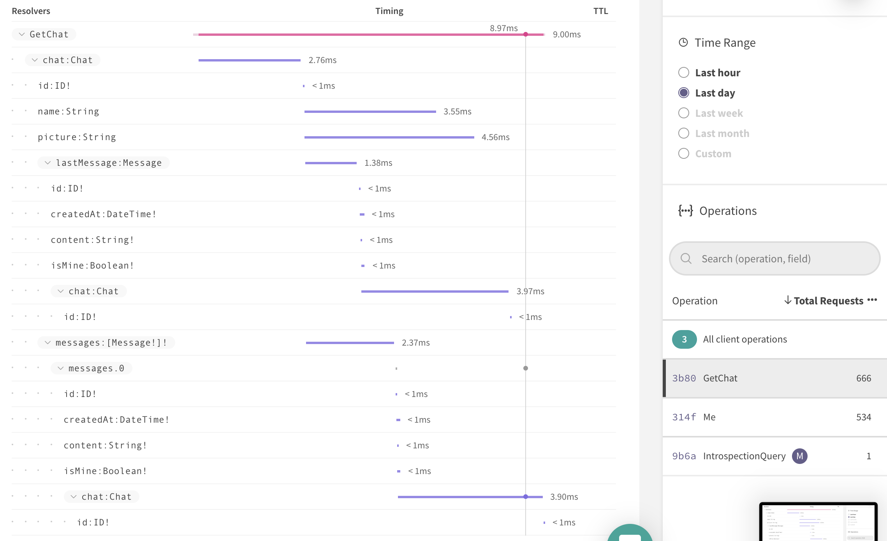

As you can see at the graph above, we reduced an execution time of `isMine` field from 4ms and 5ms to less than 1. That applies for all calls, all messages so it scales well and won't grow as list of messages increases.

But there's more... We see `chat` field being computed over and over again. So again, let's repeat the same steps.
The `Message.chat` resolver asks `Chats` service and its `findChatById` method which makes a SQL call.

The deduplication logic, we introduced in the previous step, helps to immediately resolve all `Message.chat` fields except the first occurrence but there's still a space for improvements.

The `Query.chats` resolver is invoked before the `Message.chat` which means at this point, we already have knowledge about the chats.

Let's implement a caching logic for chats so we could reuse them. We will do it in few steps.

First, because we're going to use `Dataloader`, `Chats` class should have private and public API.

[{]: <helper> (diffStep "14.3" module="server")

#### [__Server__ Step 14.3: Separate db query from public API](https://github.com/Urigo/WhatsApp-Clone-Server/commit/a82769d409b8099b926f11a004ab0a57ae3a958b)

##### Changed modules&#x2F;chats&#x2F;chats.provider.ts
```diff
@@ -11,6 +11,10 @@
 ┊11┊11┊  @Inject() private pubsub: PubSub;
 ┊12┊12┊
 ┊13┊13┊  async findChatsByUser(userId: string) {
+┊  ┊14┊    return this._findChatsByUser(userId);
+┊  ┊15┊  }
+┊  ┊16┊
+┊  ┊17┊  private async _findChatsByUser(userId: string) {
 ┊14┊18┊    const { rows } = await this.db.query(sql`
 ┊15┊19┊      SELECT chats.* FROM chats, chats_users
 ┊16┊20┊      WHERE chats.id = chats_users.chat_id
```

[}]: #

The private method is responsible for quering data from the database but the public one is to allow communication between the service and its consumers.
It's also there so we could switch to using Dataloader later on.

We did that to `findChatsByUser` but there are more:

[{]: <helper> (diffStep "14.4" module="server")

#### [__Server__ Step 14.4: Separate findChatByUser](https://github.com/Urigo/WhatsApp-Clone-Server/commit/bebd00a7ba16ce656be186f60a8cc1a8e92fd086)

##### Changed modules&#x2F;chats&#x2F;chats.provider.ts
```diff
@@ -25,6 +25,18 @@
 ┊25┊25┊  }
 ┊26┊26┊
 ┊27┊27┊  async findChatByUser({ chatId, userId }: { chatId: string; userId: string }) {
+┊  ┊28┊    const rows = await this._findChatByUser({ chatId, userId });
+┊  ┊29┊
+┊  ┊30┊    return rows[0] || null;
+┊  ┊31┊  }
+┊  ┊32┊
+┊  ┊33┊  private async _findChatByUser({
+┊  ┊34┊    chatId,
+┊  ┊35┊    userId,
+┊  ┊36┊  }: {
+┊  ┊37┊    chatId: string;
+┊  ┊38┊    userId: string;
+┊  ┊39┊  }) {
 ┊28┊40┊    const { rows } = await this.db.query(sql`
 ┊29┊41┊      SELECT chats.* FROM chats, chats_users
 ┊30┊42┊      WHERE chats_users.chat_id = ${chatId}
```
```diff
@@ -32,7 +44,7 @@
 ┊32┊44┊      AND chats_users.user_id = ${userId}
 ┊33┊45┊    `);
 ┊34┊46┊
-┊35┊  ┊    return rows[0] || null;
+┊  ┊47┊    return rows;
 ┊36┊48┊  }
 ┊37┊49┊
 ┊38┊50┊  async findChatById(chatId: string) {
```

[}]: #
[{]: <helper> (diffStep "14.5" module="server")

#### [__Server__ Step 14.5: Separate findChatById](https://github.com/Urigo/WhatsApp-Clone-Server/commit/93e0f319f362e875d52cda65cd4534d9d1961837)

##### Changed modules&#x2F;chats&#x2F;chats.provider.ts
```diff
@@ -48,10 +48,15 @@
 ┊48┊48┊  }
 ┊49┊49┊
 ┊50┊50┊  async findChatById(chatId: string) {
+┊  ┊51┊    const rows = await this._findChatById(chatId);
+┊  ┊52┊    return rows[0] || null;
+┊  ┊53┊  }
+┊  ┊54┊
+┊  ┊55┊  private async _findChatById(chatId: string) {
 ┊51┊56┊    const { rows } = await this.db.query(sql`
 ┊52┊57┊      SELECT * FROM chats WHERE id = ${chatId}
 ┊53┊58┊    `);
-┊54┊  ┊    return rows[0] || null;
+┊  ┊59┊    return rows;
 ┊55┊60┊  }
 ┊56┊61┊
 ┊57┊62┊  async findMessagesByChat(chatId: string) {
```

[}]: #

> Because those private methods are just to query data, make sure they all return untouched `row` object.

Now's the most interesting part, Dataloader.

[{]: <helper> (diffStep "14.6" module="server")

#### [__Server__ Step 14.6: Use Dataloader in Chats](https://github.com/Urigo/WhatsApp-Clone-Server/commit/1bf9186bf72cf3f512076d6c6fb0bed8168b2f3e)

##### Changed modules&#x2F;chats&#x2F;chats.provider.ts
```diff
@@ -1,8 +1,23 @@
 ┊ 1┊ 1┊import { Injectable, Inject, ProviderScope } from '@graphql-modules/di';
+┊  ┊ 2┊import { QueryResult } from 'pg';
 ┊ 2┊ 3┊import sql from 'sql-template-strings';
+┊  ┊ 4┊import DataLoader from 'dataloader';
 ┊ 3┊ 5┊import { Database } from '../common/database.provider';
 ┊ 4┊ 6┊import { PubSub } from '../common/pubsub.provider';
 ┊ 5┊ 7┊
+┊  ┊ 8┊type ChatsByUser = { userId: string };
+┊  ┊ 9┊type ChatByUser = { userId: string; chatId: string };
+┊  ┊10┊type ChatById = { chatId: string };
+┊  ┊11┊type ChatsKey = ChatById | ChatByUser | ChatsByUser;
+┊  ┊12┊
+┊  ┊13┊function isChatsByUser(query: any): query is ChatsByUser {
+┊  ┊14┊  return query.userId && !query.chatId;
+┊  ┊15┊}
+┊  ┊16┊
+┊  ┊17┊function isChatByUser(query: any): query is ChatByUser {
+┊  ┊18┊  return query.userId && query.chatId;
+┊  ┊19┊}
+┊  ┊20┊
 ┊ 6┊21┊@Injectable({
 ┊ 7┊22┊  scope: ProviderScope.Session,
 ┊ 8┊23┊})
```
```diff
@@ -10,8 +25,26 @@
 ┊10┊25┊  @Inject() private db: Database;
 ┊11┊26┊  @Inject() private pubsub: PubSub;
 ┊12┊27┊
+┊  ┊28┊  private loaders = {
+┊  ┊29┊    chats: new DataLoader<ChatsKey, QueryResult['rows']>(keys => {
+┊  ┊30┊      return Promise.all(
+┊  ┊31┊        keys.map(async query => {
+┊  ┊32┊          if (isChatsByUser(query)) {
+┊  ┊33┊            return this._findChatsByUser(query.userId);
+┊  ┊34┊          }
+┊  ┊35┊
+┊  ┊36┊          if (isChatByUser(query)) {
+┊  ┊37┊            return this._findChatByUser(query);
+┊  ┊38┊          }
+┊  ┊39┊
+┊  ┊40┊          return this._findChatById(query.chatId);
+┊  ┊41┊        })
+┊  ┊42┊      );
+┊  ┊43┊    }),
+┊  ┊44┊  };
+┊  ┊45┊
 ┊13┊46┊  async findChatsByUser(userId: string) {
-┊14┊  ┊    return this._findChatsByUser(userId);
+┊  ┊47┊    return this.loaders.chats.load({ userId });
 ┊15┊48┊  }
 ┊16┊49┊
 ┊17┊50┊  private async _findChatsByUser(userId: string) {
```
```diff
@@ -25,7 +58,7 @@
 ┊25┊58┊  }
 ┊26┊59┊
 ┊27┊60┊  async findChatByUser({ chatId, userId }: { chatId: string; userId: string }) {
-┊28┊  ┊    const rows = await this._findChatByUser({ chatId, userId });
+┊  ┊61┊    const rows = await this.loaders.chats.load({ chatId, userId });
 ┊29┊62┊
 ┊30┊63┊    return rows[0] || null;
 ┊31┊64┊  }
```
```diff
@@ -48,7 +81,7 @@
 ┊48┊81┊  }
 ┊49┊82┊
 ┊50┊83┊  async findChatById(chatId: string) {
-┊51┊  ┊    const rows = await this._findChatById(chatId);
+┊  ┊84┊    const rows = await this.loaders.chats.load({ chatId });
 ┊52┊85┊    return rows[0] || null;
 ┊53┊86┊  }
 ┊54┊87┊
```

##### Changed package.json
```diff
@@ -50,6 +50,7 @@
 ┊50┊50┊    "cookie": "0.4.0",
 ┊51┊51┊    "cors": "2.8.5",
 ┊52┊52┊    "cookie-parser": "1.4.5",
+┊  ┊53┊    "dataloader": "2.0.0",
 ┊53┊54┊    "express": "4.17.1",
 ┊54┊55┊    "graphql": "14.6.0",
 ┊55┊56┊    "graphql-import": "1.0.1",
```

[}]: #

We introduced `ChatsKey` that is a union type, to standarize the input value. Those helper methods like `isChatsByUser` and `isChatByUser` are there to decide what should be fetched.

In every public method that we previously changed, there's now Dataloader in use but that's not entirely what we're trying to achieve.

The caching mechanism is not yet completed. We deduplicate requests but in some cases, we ask for chats that are already there, so we need to intercept our dataloader logic and introduce caching.

[{]: <helper> (diffStep "14.7" module="server")

#### [__Server__ Step 14.7: Implement caching for Chats](https://github.com/Urigo/WhatsApp-Clone-Server/commit/3f92511bc838270b54a0c0eda3ea8de44b067a85)

##### Changed modules&#x2F;chats&#x2F;chats.provider.ts
```diff
@@ -4,6 +4,7 @@
 ┊ 4┊ 4┊import DataLoader from 'dataloader';
 ┊ 5┊ 5┊import { Database } from '../common/database.provider';
 ┊ 6┊ 6┊import { PubSub } from '../common/pubsub.provider';
+┊  ┊ 7┊import { Chat } from '../../db';
 ┊ 7┊ 8┊
 ┊ 8┊ 9┊type ChatsByUser = { userId: string };
 ┊ 9┊10┊type ChatByUser = { userId: string; chatId: string };
```
```diff
@@ -25,6 +26,7 @@
 ┊25┊26┊  @Inject() private db: Database;
 ┊26┊27┊  @Inject() private pubsub: PubSub;
 ┊27┊28┊
+┊  ┊29┊  private chatsCache = new Map<string, Chat>();
 ┊28┊30┊  private loaders = {
 ┊29┊31┊    chats: new DataLoader<ChatsKey, QueryResult['rows']>(keys => {
 ┊30┊32┊      return Promise.all(
```
```diff
@@ -33,6 +35,10 @@
 ┊33┊35┊            return this._findChatsByUser(query.userId);
 ┊34┊36┊          }
 ┊35┊37┊
+┊  ┊38┊          if (this.chatsCache.has(query.chatId)) {
+┊  ┊39┊            return [this._readChatFromCache(query.chatId)];
+┊  ┊40┊          }
+┊  ┊41┊
 ┊36┊42┊          if (isChatByUser(query)) {
 ┊37┊43┊            return this._findChatByUser(query);
 ┊38┊44┊          }
```
```diff
@@ -254,4 +260,14 @@
 ┊254┊260┊      throw e;
 ┊255┊261┊    }
 ┊256┊262┊  }
+┊   ┊263┊
+┊   ┊264┊  private _readChatFromCache(chatId: string) {
+┊   ┊265┊    return this.chatsCache.get(chatId);
+┊   ┊266┊  }
+┊   ┊267┊
+┊   ┊268┊  private _writeChatToCache(chat?: Chat) {
+┊   ┊269┊    if (chat) {
+┊   ┊270┊      this.chatsCache.set(chat.id, chat);
+┊   ┊271┊    }
+┊   ┊272┊  }
 ┊257┊273┊}
```

[}]: #

Whenever we ask for a single chat that is available, it's being resolved right away but we still need to write data to the cache.

[{]: <helper> (diffStep "14.8" module="server")

#### [__Server__ Step 14.8: Write chats to the cache](https://github.com/Urigo/WhatsApp-Clone-Server/commit/923a7e6d8f5fc36a6ecab0edacbb24eba2e32395)

##### Changed modules&#x2F;chats&#x2F;chats.provider.ts
```diff
@@ -60,6 +60,10 @@
 ┊60┊60┊      AND chats_users.user_id = ${userId}
 ┊61┊61┊    `);
 ┊62┊62┊
+┊  ┊63┊    rows.forEach(row => {
+┊  ┊64┊      this._writeChatToCache(row);
+┊  ┊65┊    });
+┊  ┊66┊
 ┊63┊67┊    return rows;
 ┊64┊68┊  }
 ┊65┊69┊
```
```diff
@@ -83,6 +87,8 @@
 ┊83┊87┊      AND chats_users.user_id = ${userId}
 ┊84┊88┊    `);
 ┊85┊89┊
+┊  ┊90┊    this._writeChatToCache(rows[0]);
+┊  ┊91┊
 ┊86┊92┊    return rows;
 ┊87┊93┊  }
 ┊88┊94┊
```
```diff
@@ -95,6 +101,9 @@
 ┊ 95┊101┊    const { rows } = await this.db.query(sql`
 ┊ 96┊102┊      SELECT * FROM chats WHERE id = ${chatId}
 ┊ 97┊103┊    `);
+┊   ┊104┊
+┊   ┊105┊    this._writeChatToCache(rows[0]);
+┊   ┊106┊
 ┊ 98┊107┊    return rows;
 ┊ 99┊108┊  }
```

[}]: #

Let's look at charts in Apollo Engine.

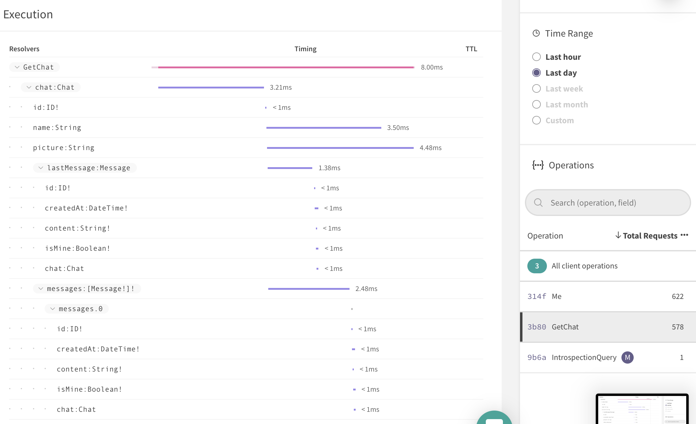

We cut off `Message.chat` to less than 1ms.

The `Chat.name` and `Chat.picture` resolvers share the same logic and since Database service is wrapped with DataLoader, we make a single SQL query. Unfortunately, it's not visible on the graph.

Let's summarize our work. **We made the GetChat operation almost 60% faster on average** and it's just based on one chat with one message. The number would be much much higher on a bigger scale.

### Preventing issues

The Apollo Engine has another interesting feature. It’s called Alerts. You set a threshold for all operations or a specific one and whenever it takes longer, you get a notification on Slack. But there’s a catch, you need to pay in order to unlock it.

We’re working on something similar but entirely open-sourced. It’s an extension of ApolloServer that lets you track operations and get exactly what you would get from the engine but self-hosted.

## UI Performance

The part would be the User Interface and the web app in general.

### Metrics

There's a highly recommended and very comprehensive publication written by Philip Walton (Engineer at Google) called ["User-centric Performance Metrics"](https://developers.google.com/web/fundamentals/performance/user-centric-performance-metrics) that was an inspiration for this chapter. We’re going to talk in short about measuring render performance of a web application.

Let’s base this chapter on real data. First, open the app and go to Performance tab of Chrome DevTools.

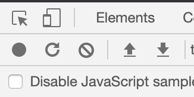

Now click on “Start profiling and reload page”. After it’s done you should see the following:

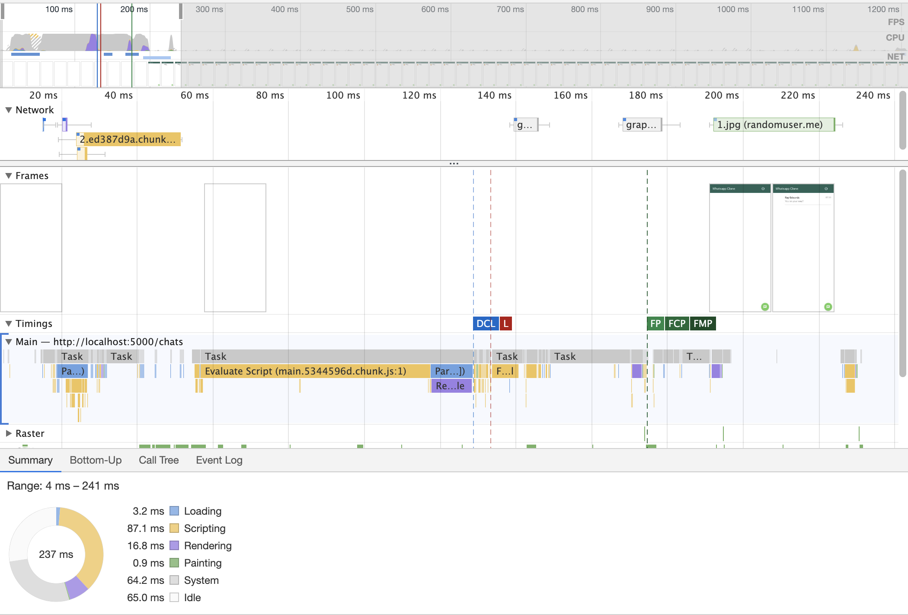

Right now it may not make a lot of sense, so we’re going to start with something basic.

There’s many different kinds of charts but we will cover only few of them: Network, Frames, Timings and Main.

Let’s check out the Timings section and explain few important performance metrics.

- DCL - DOMContentLoaded Event
- L - Onload Event
- FP - First Paint
- FCP - First Contentful Paint
- FMP - First Meaningful Paint

There’s also another one that is not visible on the timeline but also not less important, TTI - Time to Interactive.

We will focus on FP, FCP, FMP and TTI.

The primary difference between the two metrics is **First Paint** marks the point when the browser renders anything that is visually different from what was on the screen prior to navigation. By contrast, **First Contentful Paint** is the point when the browser renders the first bit of content from the DOM, which may be text, an image, SVG, or even a `<canvas>` element.

The **First Meaningful Paint** should mark the point when something useful was rendered. It might mean an input box on Google, video player on YouTube or in our case, a list of chats.

The **Time To Interactive** metric marks the point at which the application is both visually rendered and capable of reliably responding to user input.

Now with all that knowledge we can move on to something more practical, the **Frames panel**. The main purpose here is to see what’s rendered at given time. In our case, the first paint was made after over 200ms, which is not a bad result at all but see that huge blank space next to it.

The **Network section**, is going to help us out here and give some pointers of what might be a reason of it. It’s a timeline that explains when each request was made and how long it took to resolve.

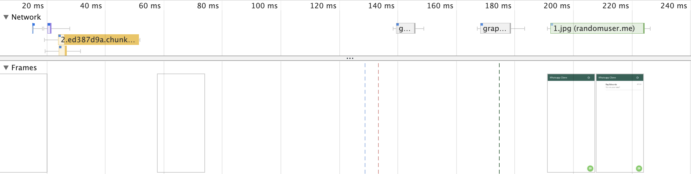

What do we see here? One of the first requests are js files and we need those to bootstrap and render the app. That’s the reason of the blank page.

We could improve that by either Server-Side Rendering or using a Service Worker.

### Rendering improvements

#### Server-Side Rendering

Implementing SSR means you run the app on server, before it’s being shipped to the client and the document’s content is not just `<html><body><app></app></body></html>` but an actual markup with all the components in it. Because it’s a part of the document, the browser can already display something meaningful and after js files are loaded, the app bootstraps on the client and it becomes interactive. There is one caveat. Wherever you ship the app it has to be able to run node js.

#### Store Rehydration

When talking SSR it’s worth to mention GraphQL and related technique called Store Rehydration. API calls are an important part of an application and plays a huge role in SSR.

GraphQL operations are called once components are mounted which means the cache is filled up and why not reuse it on client.

How would it work? Data is extracted from the apollo’s cache and passed within a document. After it’s received by the browser, the app runs and so does the Apollo Client. While it happens we look for the data and fill up the cache. Now whenever a component calls a GraphQL operation, the result is already in the cache and resolves immediately.

#### Service Worker

Another approach is a bit different. By using a Service Worker, we’re able to control and cache requests, including js files, images etc. On the first visit, the app loads exactly the same as without SSR but the next visits are a bit faster. It’s because the Service Worker is registered after you close the app and of course we can’t cache things that weren’t fetched yet.

Both techniques are not mutually exclusive and we highly recommend to use both.

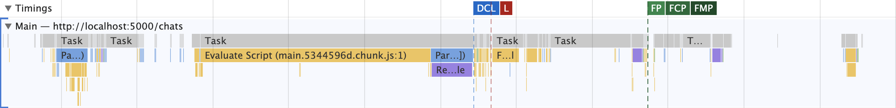

The next section we’re going to talk about is the **Main panel**, a flame chart of activity on the main thread. You see those blocks? They represent an event, the wider it is the longer it took. One of the most important things to remember is to avoid long events since they block the thread.
The longest event on our timeline is the Evaluate Script event that involves `main.js`. The file contains all the libraries and the core functionality, those are needed to run the app. By making it lighter we would decrease the time of the first render.
We already do something to reduce the bundle size, This technique we use is called code-splitting and it allows to split one piece of code into multiple files which are lazy loaded.
It cuts off the size of the main bundle and the rest is loaded on demand, let’s say login page is in a different chunk than list of chats.

### Tooling

There’s one tool built into Chrome DevTools called Lighthouse that allows to measure, collect metrics and get helpful tips on how to improve the performance and where are the pain points.

Here’s the example:

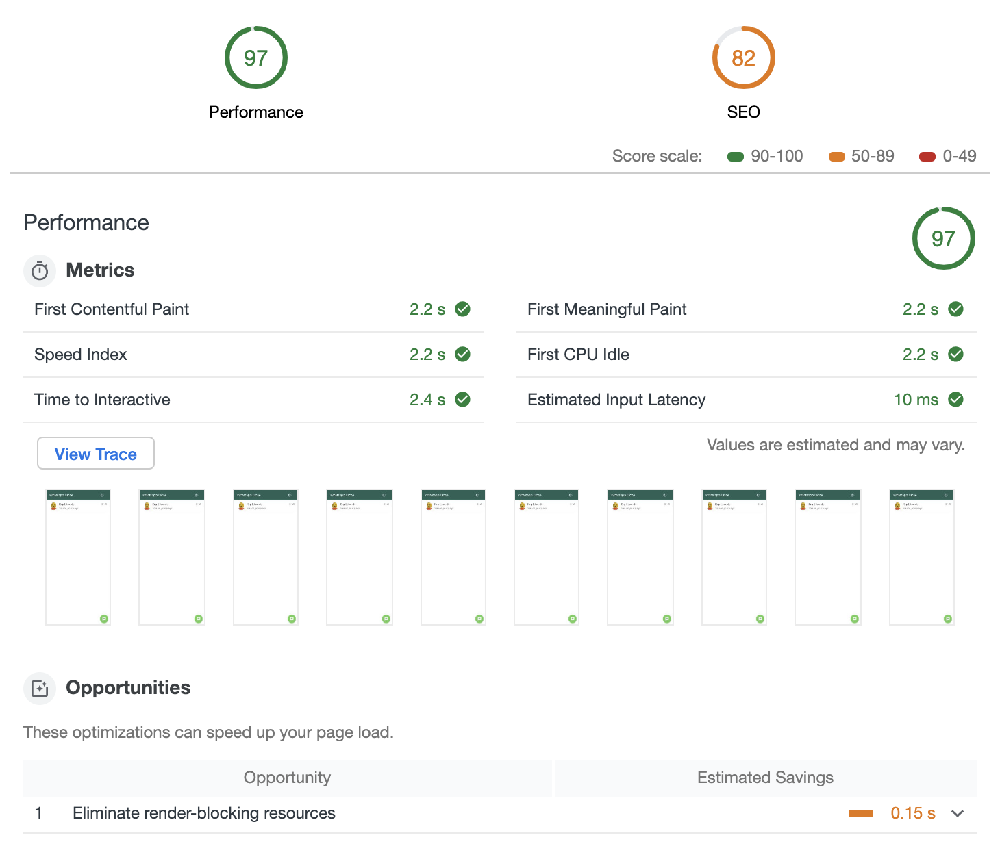

Once your app is optimized you want to prevent regressions. Lighthouse has you covered! It may run as part of Continuous Integration and prevents deployment when key metrics regress or drop below a certain threshold.

## Making the app feels instant

Dealing with slow network can be hard so let's simulate that situation. After all, running the application on local host will always result in low response times.

Luckily most browser come with a built in solution for that - we can simulate a slow network by defining the throttle level:

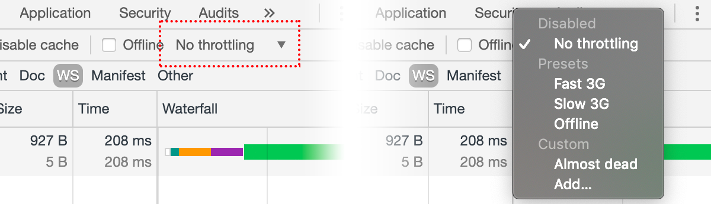

If we will refresh the application, we should notice a significant slow down the first time we load each screen; about few seconds to load each of them. To ensure that this is really caused by a slow network and not by anything else, we can open the dev-tools of our browser (let’s assume you use Chrome) and under the `network` tab we should notice the network activity times.

> More information about monitoring network activity and throttling it using the Chrome’s dev-tools can be found in [the official dev-tools docs page](https://developers.google.com/web/tools/chrome-devtools/network/).

To solve these issues there are a couple of changes we’re gonna make in the way we fetch and manage data.

### Optimistic UI

As you know, pretty much in all cases, everything in Apollo flows through its cache. If a requested data is in there, a query is resolved right away. Mutations are a bit different, they have to reach the server every single time. Seems like nothing we can do about it but fortunately we can simulate the mutation, predict the result and make Apollo treat it as a temporary data. Which means, the app’s state and all components are updated and the change is visible instantly after it’s made.

In case of the WhatsApp clone, whenever a new message is sent, we will see it right away, on the screen, doesn’t matter if the network is low or even super fast. You may experience the similar behavior on Facebook’s Messenger.


```graphql
  mutation AddMessage($chatId: ID!, $content: String!) {
    addMessage(chatId: $chatId, content: $content) {
      ...Message
    }
  }
```

```graphql
  addMessage({
    variables: { chatId, content },
    optimisticResponse: {
      __typename: 'Mutation',
      addMessage: {
        __typename: 'Message',
        id: Math.random().toString(36).substr(2, 9),
        createdAt: new Date(),
        isMine: true,
        chat: {
          __typename: 'Chat',
          id: chatId,
        },
        content,
      }
    },
    update: (client, { data: { addMessage } }) => {
      writeMessage(client, addMessage);
    },
  })
```

We used words “predict” and “simulate”, what if the mutation behaves differently or what’s more interesting, it fails. Apollo handles that as well. The “real” response overwrites the fake one and the store is reverted back to the original state.

### Prefetching data

Another technique but with a bit different purpose is about fetching data in advance. In some situations, you might be able to predict which page/component is going to be entered next.

Let’s base it on a real example. The WhatsApp clone has a page with a list of chats. The component that represents the page, calls a GraphQL operation to fetch that list. Right now, when user clicks on one of the chats, he’s redirected to a partially empty page because of the ongoing GraphQL request. What if we could fetch that data in advance? That’s what this technique is about. We could predict user’s next move based on a simple mouse event or even by using Artificial Intelligence and data collected by Google Analytics, so whenever the move actually happens, the data is already in the cache.

[{]: <helper> (diffStep "15.1" files="src/components/ChatRoomScreen/index.tsx" module="client")

#### [__Client__ Step 15.1: Implement prefetching](https://github.com/Urigo/WhatsApp-Clone-Client-React/commit/8da602e3620082f7ce884797d0e588d29677671e)

##### Changed src&#x2F;components&#x2F;ChatRoomScreen&#x2F;index.tsx
```diff
@@ -2,12 +2,19 @@
 ┊ 2┊ 2┊import React from 'react';
 ┊ 3┊ 3┊import { useCallback } from 'react';
 ┊ 4┊ 4┊import { Redirect } from 'react-router-dom';
+┊  ┊ 5┊import { useApolloClient } from '@apollo/react-hooks';
 ┊ 5┊ 6┊import styled from 'styled-components';
 ┊ 6┊ 7┊import ChatNavbar from './ChatNavbar';
 ┊ 7┊ 8┊import MessageInput from './MessageInput';
 ┊ 8┊ 9┊import MessagesList from './MessagesList';
 ┊ 9┊10┊import { History } from 'history';
-┊10┊  ┊import { useGetChatQuery, useAddMessageMutation } from '../../graphql/types';
+┊  ┊11┊import {
+┊  ┊12┊  useGetChatQuery,
+┊  ┊13┊  useAddMessageMutation,
+┊  ┊14┊  GetChatQuery,
+┊  ┊15┊  GetChatQueryVariables,
+┊  ┊16┊  GetChatDocument,
+┊  ┊17┊} from '../../graphql/types';
 ┊11┊18┊import * as fragments from '../../graphql/fragments';
 ┊12┊19┊import { writeMessage } from '../../services/cache.service';
 ┊13┊20┊
```
```diff
@@ -38,6 +45,19 @@
 ┊38┊45┊  ${fragments.message}
 ┊39┊46┊`;
 ┊40┊47┊
+┊  ┊48┊export const useGetChatPrefetch = () => {
+┊  ┊49┊  const client = useApolloClient();
+┊  ┊50┊
+┊  ┊51┊  return (chatId: string) => {
+┊  ┊52┊    client.query<GetChatQuery, GetChatQueryVariables>({
+┊  ┊53┊      query: GetChatDocument,
+┊  ┊54┊      variables: {
+┊  ┊55┊        chatId,
+┊  ┊56┊      },
+┊  ┊57┊    });
+┊  ┊58┊  };
+┊  ┊59┊};
+┊  ┊60┊
 ┊41┊61┊interface ChatRoomScreenParams {
 ┊42┊62┊  chatId: string;
 ┊43┊63┊  history: History;
```

[}]: #

We created the `useGetChatPrefetch` hook that gets ApolloClient instance through `useApolloClient` and returns a function to prefetch data. In this case we request `GetChat` operation. Because Apollo deduplicates queries, we won't make multiple http calls, we're safe.

The actual usage of `useGetChatPrefetch`, happens on `mouse entered` event:

[{]: <helper> (diffStep "15.1" files="src/components/ChatsListScreen/ChatsList.tsx" module="client")

#### [__Client__ Step 15.1: Implement prefetching](https://github.com/Urigo/WhatsApp-Clone-Client-React/commit/8da602e3620082f7ce884797d0e588d29677671e)

##### Changed src&#x2F;components&#x2F;ChatsListScreen&#x2F;ChatsList.tsx
```diff
@@ -5,6 +5,7 @@
 ┊ 5┊ 5┊import { useCallback } from 'react';
 ┊ 6┊ 6┊import { History } from 'history';
 ┊ 7┊ 7┊import { useChatsQuery } from '../../graphql/types';
+┊  ┊ 8┊import { useGetChatPrefetch } from '../ChatRoomScreen';
 ┊ 8┊ 9┊
 ┊ 9┊10┊const Container = styled.div`
 ┊10┊11┊  height: calc(100% - 56px);
```
```diff
@@ -69,6 +70,7 @@
 ┊69┊70┊    },
 ┊70┊71┊    [history]
 ┊71┊72┊  );
+┊  ┊73┊  const prefetchChat = useGetChatPrefetch();
 ┊72┊74┊
 ┊73┊75┊  const { data } = useChatsQuery();
 ┊74┊76┊
```
```diff
@@ -85,7 +87,10 @@
 ┊85┊87┊            key={chat.id}
 ┊86┊88┊            data-testid="chat"
 ┊87┊89┊            button
-┊88┊  ┊            onClick={navToChat.bind(null, chat)}>
+┊  ┊90┊            onClick={navToChat.bind(null, chat)}
+┊  ┊91┊            onMouseEnter={() => {
+┊  ┊92┊              prefetchChat(chat.id);
+┊  ┊93┊            }}>
 ┊89┊94┊            <ChatPicture
 ┊90┊95┊              data-testid="picture"
 ┊91┊96┊              src={chat.picture}
```

[}]: #

Now, the same but with the list of users:

[{]: <helper> (diffStep "15.1" files="src/components/ChatsListScreen/AddChatButton.tsx" module="client")

#### [__Client__ Step 15.1: Implement prefetching](https://github.com/Urigo/WhatsApp-Clone-Client-React/commit/8da602e3620082f7ce884797d0e588d29677671e)

##### Changed src&#x2F;components&#x2F;ChatsListScreen&#x2F;AddChatButton.tsx
```diff
@@ -3,6 +3,7 @@
 ┊3┊3┊import React from 'react';
 ┊4┊4┊import styled from 'styled-components';
 ┊5┊5┊import { History } from 'history';
+┊ ┊6┊import { useUsersPrefetch } from '../UsersList';
 ┊6┊7┊
 ┊7┊8┊const Container = styled.div`
 ┊8┊9┊  position: fixed;
```
```diff
@@ -18,17 +19,19 @@
 ┊18┊19┊    color: white;
 ┊19┊20┊  }
 ┊20┊21┊`;
+┊  ┊22┊
 ┊21┊23┊interface ChildComponentProps {
 ┊22┊24┊  history: History;
 ┊23┊25┊}
 ┊24┊26┊
 ┊25┊27┊const AddChatButton: React.FC<ChildComponentProps> = ({ history }) => {
+┊  ┊28┊  const prefetchUsers = useUsersPrefetch();
 ┊26┊29┊  const onClick = () => {
 ┊27┊30┊    history.push('/new-chat');
 ┊28┊31┊  };
 ┊29┊32┊
 ┊30┊33┊  return (
-┊31┊  ┊    <Container>
+┊  ┊34┊    <Container onMouseEnter={() => prefetchUsers()}>
 ┊32┊35┊      <Button
 ┊33┊36┊        data-testid="new-chat-button"
 ┊34┊37┊        variant="contained"
```

[}]: #
[{]: <helper> (diffStep "15.1" files="src/components/ChatsListScreen/ChatsList.tsx" module="client")

#### [__Client__ Step 15.1: Implement prefetching](https://github.com/Urigo/WhatsApp-Clone-Client-React/commit/8da602e3620082f7ce884797d0e588d29677671e)

##### Changed src&#x2F;components&#x2F;ChatsListScreen&#x2F;ChatsList.tsx
```diff
@@ -5,6 +5,7 @@
 ┊ 5┊ 5┊import { useCallback } from 'react';
 ┊ 6┊ 6┊import { History } from 'history';
 ┊ 7┊ 7┊import { useChatsQuery } from '../../graphql/types';
+┊  ┊ 8┊import { useGetChatPrefetch } from '../ChatRoomScreen';
 ┊ 8┊ 9┊
 ┊ 9┊10┊const Container = styled.div`
 ┊10┊11┊  height: calc(100% - 56px);
```
```diff
@@ -69,6 +70,7 @@
 ┊69┊70┊    },
 ┊70┊71┊    [history]
 ┊71┊72┊  );
+┊  ┊73┊  const prefetchChat = useGetChatPrefetch();
 ┊72┊74┊
 ┊73┊75┊  const { data } = useChatsQuery();
 ┊74┊76┊
```
```diff
@@ -85,7 +87,10 @@
 ┊85┊87┊            key={chat.id}
 ┊86┊88┊            data-testid="chat"
 ┊87┊89┊            button
-┊88┊  ┊            onClick={navToChat.bind(null, chat)}>
+┊  ┊90┊            onClick={navToChat.bind(null, chat)}
+┊  ┊91┊            onMouseEnter={() => {
+┊  ┊92┊              prefetchChat(chat.id);
+┊  ┊93┊            }}>
 ┊89┊94┊            <ChatPicture
 ┊90┊95┊              data-testid="picture"
 ┊91┊96┊              src={chat.picture}
```

[}]: #

### Splitting and Deferring Queries

Prefetching is an easy way to make your applications UI feel faster. You can use mouse events to predict the data that could be needed. This is powerful and works perfectly on the browser, but can not be applied to a mobile device.

One solution for improving the UI experience would be the usage of fragments to preload more data in a query, but loading huge amounts of data (that you probably never show to the user) is expensive.

Another solution would be to **split huge queries into two smaller queries**:

- The first one could load data which is already in the store. This means that it can be displayed instantly.
- The second query could load data which is not in the store yet and must be fetched from the server first.

This solution gives you the benefit of not fetching too much data, as well as the possibility to show some part of the views data before the server responds.

This could be used in our messaging app to load chat’s information and messages separately. This way we will see the title and the image instantly, because it’s already in the cache but messages will be loaded afterwards. UX will benefit a lot.

There’s also something very similar conceptually to Query Splitting but instead of separating queries we keep everything in one operation and annotate the parts that should be deferred. The annotation is, of course a directive and it’s called **`@defer`**.

Once the `@defer` is used, the server returns an initial response without waiting for deferred fields to resolve, using null as placeholders for them. Then, it streams patches for each deferred field asynchronously as they resolve. Thanks to that, we maintain one operation but decide how it behaves.

> Right now, this feature is not well supported in Apollo Server so we don’t recommend to use it yet. Keep it on mind though.

### Dealing with rendering issues

The most naive thing we can do to start noticing performance issues would be loading TONS of data to our app, and make sure that each view is absolutely overwhelmed with information. This way performance issues will start rising above the surface pretty quickly. To do that, we will edit the `resetDb()` method on the server so it can generate large quantities of data. The most comfortable way of controlling that behavior would be through an environment variable that will tell the reset method how much iterations it should run. The more iterations, the more data would be fabricated:

[{]: <helper> (diffStep "15.10" module="server")

#### Step 15.10: NOT FOUND!

[}]: #

It’s important to note that we’ve generated the data in a very specific way where a single user will be the center of the network of data. This way when we log in with that user, we should see our views packed. If it wasn’t for that we would have just had large quantities of data in the DB, but none of it would appear to the end-user.

Now, we will restart the server and this time run it differently. We will provide `FAKED_DB` with a value of `100` which should connect us to 100 messages per single view:

    RESET_DB=true FAKED_DB=100 yarn start

Now make sure that the application is running and log-in with the first user of Ray Edwards using the credentials:

    username: ray
    passowrd: 111

Now try to navigate around between the `ChatsScreen` and `ChatBoxScreen`. You’ll notice that each transition takes a long time until it shows the data. It’s obviously something which is related to rendering and not data transportation, because the slowdown also happens the second time you visit a view, a point where the fetched data should have already been stored by Apollo in cache. So we’ve already detected one performance issue we should deal with.

### Pagination

To solve it, there are couple of changes we’re gonna make in the way we ask for data, messages will be fetched dynamically based on our scrolling position.

With these changes, the requests will be splitted into smaller chunks, and React DOM won’t have to deal with a lot of data the first time it loads. There are few challenges that may arise from this implementation:

- Representing queries in a way that they can be loaded in chunks
- Sending requests and updating the view dynamically
- Maintaining updates from subscriptions

To start with, we will first take on the task of improving initialization times. We will release the pressure by fetching only the first 20 messages. This way when we visit a chat, it should be loaded faster.

For that we're going to implement cursor-based pagination. We will add `after` and `limit` arguments to `Chat.messages` that could be used to fetch a specific snapshot of available messages.

- `after` is optional and marks the point where the last fetch ended (what is the last element of a received list)
- `limit` is required, defines amount of data

A common design pattern for fetching data snapshots from a GraphQL back-end is called [Relay](https://facebook.github.io/relay/docs/en/graphql-server-specification.html). Relay provides a robust solution which is suitable for things like search engines.

We will define our own version of it.

[{]: <helper> (diffStep "14.9" module="server")

#### [__Server__ Step 14.9: Add fake data](https://github.com/Urigo/WhatsApp-Clone-Server/commit/021c22191192d60ae2bdba6318abd9b49cedda24)

##### Changed db.ts
```diff
@@ -1,6 +1,8 @@
 ┊1┊1┊import { Pool } from 'pg';
 ┊2┊2┊import sql from 'sql-template-strings';
-┊3┊ ┊import { resetDb as envResetDb } from './env';
+┊ ┊3┊import faker from 'faker';
+┊ ┊4┊import addMinutes from 'date-fns/addMinutes';
+┊ ┊5┊import { resetDb as envResetDb, fakedDb } from './env';
 ┊4┊6┊
 ┊5┊7┊export type User = {
 ┊6┊8┊  id: string;
```
```diff
@@ -232,6 +234,10 @@
 ┊232┊234┊    },
 ┊233┊235┊  ];
 ┊234┊236┊
+┊   ┊237┊  if (fakedDb) {
+┊   ┊238┊    addFakedMessages(sampleMessages, fakedDb);
+┊   ┊239┊  }
+┊   ┊240┊
 ┊235┊241┊  for (const sampleMessage of sampleMessages) {
 ┊236┊242┊    await pool.query(sql`
 ┊237┊243┊      INSERT INTO messages(id, content, created_at, chat_id, sender_user_id)
```
```diff
@@ -244,6 +250,21 @@
 ┊244┊250┊  );
 ┊245┊251┊};
 ┊246┊252┊
+┊   ┊253┊function addFakedMessages(messages: Message[], count: number) {
+┊   ┊254┊  const message = messages[0];
+┊   ┊255┊  const date = message.created_at;
+┊   ┊256┊  const id = messages.length + 1;
+┊   ┊257┊
+┊   ┊258┊  new Array(count).fill(0).forEach((_, i) => {
+┊   ┊259┊    messages.push({
+┊   ┊260┊      ...message,
+┊   ┊261┊      id: `${id + i}`,
+┊   ┊262┊      content: faker.lorem.sentence(4),
+┊   ┊263┊      created_at: addMinutes(date, i + 1),
+┊   ┊264┊    });
+┊   ┊265┊  });
+┊   ┊266┊}
+┊   ┊267┊
 ┊247┊268┊if (envResetDb) {
 ┊248┊269┊  resetDb();
 ┊249┊270┊}
```

##### Changed env.ts
```diff
@@ -5,3 +5,6 @@
 ┊ 5┊ 5┊export const origin = process.env.ORIGIN || 'http://localhost:3000';
 ┊ 6┊ 6┊export const port = process.env.PORT || 4000;
 ┊ 7┊ 7┊export const resetDb = process.env.RESET_DB || false;
+┊  ┊ 8┊export const fakedDb = process.env.FAKED_DB
+┊  ┊ 9┊  ? parseInt(process.env.FAKED_DB, 10)
+┊  ┊10┊  : 0;
```

##### Changed modules&#x2F;chats&#x2F;chats.provider.ts
```diff
@@ -28,9 +28,9 @@
 ┊28┊28┊
 ┊29┊29┊  private chatsCache = new Map<string, Chat>();
 ┊30┊30┊  private loaders = {
-┊31┊  ┊    chats: new DataLoader<ChatsKey, QueryResult['rows']>(keys => {
+┊  ┊31┊    chats: new DataLoader<ChatsKey, QueryResult['rows']>((keys) => {
 ┊32┊32┊      return Promise.all(
-┊33┊  ┊        keys.map(async query => {
+┊  ┊33┊        keys.map(async (query) => {
 ┊34┊34┊          if (isChatsByUser(query)) {
 ┊35┊35┊            return this._findChatsByUser(query.userId);
 ┊36┊36┊          }
```
```diff
@@ -60,7 +60,7 @@
 ┊60┊60┊      AND chats_users.user_id = ${userId}
 ┊61┊61┊    `);
 ┊62┊62┊
-┊63┊  ┊    rows.forEach(row => {
+┊  ┊63┊    rows.forEach((row) => {
 ┊64┊64┊      this._writeChatToCache(row);
 ┊65┊65┊    });
 ┊66┊66┊
```

##### Changed modules&#x2F;common&#x2F;database.provider.ts
```diff
@@ -13,9 +13,9 @@
 ┊13┊13┊
 ┊14┊14┊  constructor(private pool: Pool) {
 ┊15┊15┊    this.loader = new Dataloader(
-┊16┊  ┊      queries =>
+┊  ┊16┊      (queries) =>
 ┊17┊17┊        Promise.all(
-┊18┊  ┊          queries.map(async query => {
+┊  ┊18┊          queries.map(async (query) => {
 ┊19┊19┊            const db = await this.getClient();
 ┊20┊20┊            return db.query(query);
 ┊21┊21┊          })
```

##### Changed package.json
```diff
@@ -25,6 +25,7 @@
 ┊25┊25┊    "@types/cookie": "0.3.3",
 ┊26┊26┊    "@types/cookie-parser": "1.4.2",
 ┊27┊27┊    "@types/express": "4.17.3",
+┊  ┊28┊    "@types/faker": "4.1.11",
 ┊28┊29┊    "@types/graphql": "14.5.0",
 ┊29┊30┊    "@types/jest": "25.1.4",
 ┊30┊31┊    "@types/jsonwebtoken": "8.3.8",
```
```diff
@@ -51,7 +52,9 @@
 ┊51┊52┊    "cors": "2.8.5",
 ┊52┊53┊    "cookie-parser": "1.4.5",
 ┊53┊54┊    "dataloader": "2.0.0",
+┊  ┊55┊    "date-fns": "2.11.1",
 ┊54┊56┊    "express": "4.17.1",
+┊  ┊57┊    "faker": "4.1.0",
 ┊55┊58┊    "graphql": "14.6.0",
 ┊56┊59┊    "graphql-import": "1.0.1",
 ┊57┊60┊    "graphql-scalars": "1.0.9",
```

[}]: #

The `MessagesResult` is built of:

- `cursor` - marks the end of a fetched list
- `hasMore` - tells if there's more data to ask for
- `message` - has the same type as `Chat.messages` previously had

Because the cursor marks the edge of received data, it has to be something we could use while sorting. The most obvious choice is the date of creation, so `created_at` column of `messages` table.

It's stored as `YYYY-MM-DD HH:mm:ss` but we want to expose it as something easier to work with, let's say a `number`.

In order to do it quickly, let's add `date-fns` package:

    npm install date-fns

It has `format` method that will help us to do conversions.

We need to the logic of `Chats.findMessagesByChat` method.

[{]: <helper> (diffStep "14.11" module="server")

#### [__Server__ Step 14.11: Implement cursor-based pagination in messages](https://github.com/Urigo/WhatsApp-Clone-Server/commit/654f70c33ed03c214709072b747f2415e661c85b)

##### Changed modules&#x2F;chats&#x2F;chats.provider.ts
```diff
@@ -2,6 +2,7 @@
 ┊2┊2┊import { QueryResult } from 'pg';
 ┊3┊3┊import sql from 'sql-template-strings';
 ┊4┊4┊import DataLoader from 'dataloader';
+┊ ┊5┊import format from 'date-fns/format';
 ┊5┊6┊import { Database } from '../common/database.provider';
 ┊6┊7┊import { PubSub } from '../common/pubsub.provider';
 ┊7┊8┊import { Chat } from '../../db';
```
```diff
@@ -107,12 +108,55 @@
 ┊107┊108┊    return rows;
 ┊108┊109┊  }
 ┊109┊110┊
-┊110┊   ┊  async findMessagesByChat(chatId: string) {
-┊111┊   ┊    const { rows } = await this.db.query(
-┊112┊   ┊      sql`SELECT * FROM messages WHERE chat_id = ${chatId}`
+┊   ┊111┊  async findMessagesByChat({
+┊   ┊112┊    chatId,
+┊   ┊113┊    limit,
+┊   ┊114┊    after,
+┊   ┊115┊  }: {
+┊   ┊116┊    chatId: string;
+┊   ┊117┊    limit: number;
+┊   ┊118┊    after?: number | null;
+┊   ┊119┊  }): Promise<{
+┊   ┊120┊    hasMore: boolean;
+┊   ┊121┊    cursor: number | null;
+┊   ┊122┊    messages: any[];
+┊   ┊123┊  }> {
+┊   ┊124┊    const query = sql`SELECT * FROM messages`;
+┊   ┊125┊    query.append(` WHERE chat_id = ${chatId}`);
+┊   ┊126┊
+┊   ┊127┊    if (after) {
+┊   ┊128┊      // the created_at is the cursor
+┊   ┊129┊      query.append(` AND created_at < ${cursorToDate(after)}`);
+┊   ┊130┊    }
+┊   ┊131┊
+┊   ┊132┊    query.append(` ORDER BY created_at DESC LIMIT ${limit}`);
+┊   ┊133┊
+┊   ┊134┊    const { rows: messages } = await this.db.query(query);
+┊   ┊135┊
+┊   ┊136┊    if (!messages) {
+┊   ┊137┊      return {
+┊   ┊138┊        hasMore: false,
+┊   ┊139┊        cursor: null,
+┊   ┊140┊        messages: [],
+┊   ┊141┊      };
+┊   ┊142┊    }
+┊   ┊143┊
+┊   ┊144┊    // so we send them as old -> new
+┊   ┊145┊    messages.reverse();
+┊   ┊146┊
+┊   ┊147┊    // cursor is a number representation of created_at
+┊   ┊148┊    const cursor = messages.length ? new Date(messages[0].created_at).getTime() : 0;
+┊   ┊149┊    const { rows: next } = await this.db.query(
+┊   ┊150┊      sql`SELECT * FROM messages WHERE chat_id = ${chatId} AND created_at < ${cursorToDate(
+┊   ┊151┊        cursor
+┊   ┊152┊      )} ORDER BY created_at DESC LIMIT 1`
 ┊113┊153┊    );
 ┊114┊154┊
-┊115┊   ┊    return rows;
+┊   ┊155┊    return {
+┊   ┊156┊      hasMore: next.length === 1, // means there's no more messages
+┊   ┊157┊      cursor,
+┊   ┊158┊      messages,
+┊   ┊159┊    };
 ┊116┊160┊  }
 ┊117┊161┊
 ┊118┊162┊  async lastMessage(chatId: string) {
```
```diff
@@ -280,3 +324,7 @@
 ┊280┊324┊    }
 ┊281┊325┊  }
 ┊282┊326┊}
+┊   ┊327┊
+┊   ┊328┊function cursorToDate(cursor: number) {
+┊   ┊329┊  return `'${format(cursor, 'YYYY-MM-DD HH:mm:ss')}'`;
+┊   ┊330┊}
```

##### Changed modules&#x2F;chats&#x2F;index.ts
```diff
@@ -111,7 +111,11 @@
 ┊111┊111┊    },
 ┊112┊112┊
 ┊113┊113┊    async messages(chat, args, { injector }) {
-┊114┊   ┊      return injector.get(Chats).findMessagesByChat(chat.id);
+┊   ┊114┊      return injector.get(Chats).findMessagesByChat({
+┊   ┊115┊        chatId: chat.id,
+┊   ┊116┊        limit: args.limit,
+┊   ┊117┊        after: args.after,
+┊   ┊118┊      });
 ┊115┊119┊    },
 ┊116┊120┊
 ┊117┊121┊    async lastMessage(chat, args, { injector }) {
```

[}]: #

Because the order of creation matters, messages are selected quite differently than before, we keep selecting all columns but records are ordered by the date of creation.

There's an interesting thing related to the cursor. If it's provided, we query for only those messages that happened before our cursor. This way we have a valid direction, fetching more messages means fetching older records.

The last message in the list becomes of course the `cursor`.

In order to calculate `hasMore` we need to apply the same conditions as above but with `LIMIT 1` and see if we get a result.

Since the API part is done, let's take care of something much more complicated, which is always the UI...

Let's plan it first. We know we want to fetch more messages while scrolling up. That means, Infinite Scroll with a corresponding request each time we hit the top. Because we implemented prefetching, we need to know what's the `limit`. React's Context might be helpful here. There was, of course, the change in GraphQL Schema we need to take care of too.

### Apply schema changes

Since we know what the plan is, let's start with schema changes. The `Chat.messages` is no longer a list, it's an object now.

[{]: <helper> (diffStep "15.6" module="client")

#### [__Client__ Step 15.6: Apply MessagesResult type](https://github.com/Urigo/WhatsApp-Clone-Client-React/commit/5842ae8519ea6dedbff2a2033fc39f2ea0ba132d)

##### Changed src&#x2F;components&#x2F;ChatRoomScreen&#x2F;index.tsx
```diff
@@ -27,7 +27,7 @@
 ┊27┊27┊
 ┊28┊28┊// eslint-disable-next-line
 ┊29┊29┊const getChatQuery = gql`
-┊30┊  ┊  query GetChat($chatId: ID!) {
+┊  ┊30┊  query GetChat($chatId: ID!, $limit: Int!, $after: Float) {
 ┊31┊31┊    chat(chatId: $chatId) {
 ┊32┊32┊      ...FullChat
 ┊33┊33┊    }
```

##### Changed src&#x2F;graphql&#x2F;fragments&#x2F;fullChat.fragment.ts
```diff
@@ -1,14 +1,14 @@
 ┊ 1┊ 1┊import gql from 'graphql-tag';
 ┊ 2┊ 2┊import chat from './chat.fragment';
-┊ 3┊  ┊import message from './message.fragment';
+┊  ┊ 3┊import messagesResult from './messagesResult.fragment';
 ┊ 4┊ 4┊
 ┊ 5┊ 5┊export default gql`
 ┊ 6┊ 6┊  fragment FullChat on Chat {
 ┊ 7┊ 7┊    ...Chat
-┊ 8┊  ┊    messages {
-┊ 9┊  ┊      ...Message
+┊  ┊ 8┊    messages(limit: $limit, after: $after) @connection(key: "messages") {
+┊  ┊ 9┊      ...MessagesResult
 ┊10┊10┊    }
 ┊11┊11┊  }
 ┊12┊12┊  ${chat}
-┊13┊  ┊  ${message}
+┊  ┊13┊  ${messagesResult}
 ┊14┊14┊`;
```

##### Added src&#x2F;graphql&#x2F;fragments&#x2F;messagesResult.fragment.ts
```diff
@@ -0,0 +1,13 @@
+┊  ┊ 1┊import gql from 'graphql-tag';
+┊  ┊ 2┊import message from './message.fragment';
+┊  ┊ 3┊
+┊  ┊ 4┊export default gql`
+┊  ┊ 5┊  fragment MessagesResult on MessagesResult {
+┊  ┊ 6┊    cursor
+┊  ┊ 7┊    hasMore
+┊  ┊ 8┊    messages {
+┊  ┊ 9┊      ...Message
+┊  ┊10┊    }
+┊  ┊11┊  }
+┊  ┊12┊  ${message}
+┊  ┊13┊`;
```

##### Changed src&#x2F;services&#x2F;cache.service.ts
```diff
@@ -65,9 +65,9 @@
 ┊65┊65┊  if (fullChat === null || fullChat.messages === null) {
 ┊66┊66┊    return;
 ┊67┊67┊  }
-┊68┊  ┊  if (fullChat.messages.some((m: any) => m.id === message.id)) return;
+┊  ┊68┊  if (fullChat.messages.messages.some((m: any) => m.id === message.id)) return;
 ┊69┊69┊
-┊70┊  ┊  fullChat.messages.push(message);
+┊  ┊70┊  fullChat.messages.messages.push(message);
 ┊71┊71┊  fullChat.lastMessage = message;
 ┊72┊72┊
 ┊73┊73┊  client.writeFragment({
```

[}]: #

Now we need reflect those changes in generated hooks by running:

    yarn codegen

Okay, let's move on!

### Infinite Scrolling

Now this Infinite Scroll thing. The core concept is to ask for more data, once a user's scrollbar hits the top edge of the screen.

[{]: <helper> (diffStep "15.2" module="client")

#### [__Client__ Step 15.2: Basics for infinite scroll](https://github.com/Urigo/WhatsApp-Clone-Client-React/commit/3cc0e4e7438736a8b2657bf8b3ec644ba08a9cb1)

##### Added src&#x2F;hooks&#x2F;use-infinite-scroll.ts
```diff
@@ -0,0 +1,32 @@
+┊  ┊ 1┊import { useEffect, useCallback, RefObject } from 'react';
+┊  ┊ 2┊
+┊  ┊ 3┊export const useInfiniteScroll = ({
+┊  ┊ 4┊  ref,
+┊  ┊ 5┊  onLoadMore,
+┊  ┊ 6┊}: {
+┊  ┊ 7┊  onLoadMore: Function;
+┊  ┊ 8┊  ref: RefObject<HTMLElement>;
+┊  ┊ 9┊}) => {
+┊  ┊10┊  const handleScroll = useCallback(() => {
+┊  ┊11┊    if (ref.current!.scrollTop === 0) {
+┊  ┊12┊      // loads more if scrolled to top
+┊  ┊13┊      onLoadMore();
+┊  ┊14┊    }
+┊  ┊15┊  }, [ref, onLoadMore]);
+┊  ┊16┊
+┊  ┊17┊  useEffect(() => {
+┊  ┊18┊    const elem = ref.current;
+┊  ┊19┊
+┊  ┊20┊    if (!elem) {
+┊  ┊21┊      return;
+┊  ┊22┊    }
+┊  ┊23┊
+┊  ┊24┊    elem.addEventListener('scroll', handleScroll);
+┊  ┊25┊
+┊  ┊26┊    return () => {
+┊  ┊27┊      elem!.removeEventListener('scroll', handleScroll);
+┊  ┊28┊    };
+┊  ┊29┊  }, [ref, handleScroll]);
+┊  ┊30┊};
+┊  ┊31┊
+┊  ┊32┊export default useInfiniteScroll;
```

[}]: #

Our `useInfiniteScroll` hook requires:

- `ref` is a reference of a HTML element
- `onLoadMore` calls the part component back and asks for data

We used `useEffect` to add and remove a scroll event listener. The function lives as long as `ref` and `onLoadMore` stay the same, that's because we simply make use of them in `handleScroll` function. The `handleScroll` function calls `onLoadMore` when a user scrolled to the top.

It all looks fine at first, but we still need to prevent calling back once fetching is in progress.

[{]: <helper> (diffStep "15.3" module="client")

#### [__Client__ Step 15.3: Prevent calling back once fetching is in progress](https://github.com/Urigo/WhatsApp-Clone-Client-React/commit/d8dc3dc27a80ceb2e67e606b05ddc5b42aaf3115)

##### Changed src&#x2F;hooks&#x2F;use-infinite-scroll.ts
```diff
@@ -1,4 +1,4 @@
-┊1┊ ┊import { useEffect, useCallback, RefObject } from 'react';
+┊ ┊1┊import { useState, useEffect, useCallback, RefObject } from 'react';
 ┊2┊2┊
 ┊3┊3┊export const useInfiniteScroll = ({
 ┊4┊4┊  ref,
```
```diff
@@ -7,12 +7,13 @@
 ┊ 7┊ 7┊  onLoadMore: Function;
 ┊ 8┊ 8┊  ref: RefObject<HTMLElement>;
 ┊ 9┊ 9┊}) => {
+┊  ┊10┊  const [isFetching, setIsFetching] = useState(false);
 ┊10┊11┊  const handleScroll = useCallback(() => {
-┊11┊  ┊    if (ref.current!.scrollTop === 0) {
-┊12┊  ┊      // loads more if scrolled to top
-┊13┊  ┊      onLoadMore();
+┊  ┊12┊    if (ref.current!.scrollTop === 0 && isFetching === false) {
+┊  ┊13┊      // starts to fetch if scrolled to top and fetching is not in progress
+┊  ┊14┊      setIsFetching(true);
 ┊14┊15┊    }
-┊15┊  ┊  }, [ref, onLoadMore]);
+┊  ┊16┊  }, [ref, isFetching]);
 ┊16┊17┊
 ┊17┊18┊  useEffect(() => {
 ┊18┊19┊    const elem = ref.current;
```
```diff
@@ -27,6 +28,13 @@
 ┊27┊28┊      elem!.removeEventListener('scroll', handleScroll);
 ┊28┊29┊    };
 ┊29┊30┊  }, [ref, handleScroll]);
+┊  ┊31┊
+┊  ┊32┊  // loads more if fetching has started
+┊  ┊33┊  useEffect(() => {
+┊  ┊34┊    if (isFetching) {
+┊  ┊35┊      onLoadMore();
+┊  ┊36┊    }
+┊  ┊37┊  }, [isFetching, onLoadMore]);
 ┊30┊38┊};
 ┊31┊39┊
 ┊32┊40┊export default useInfiniteScroll;
```

[}]: #

That's why `isFetching` state is necessary but as you can tell, we don't set it to `false`.

[{]: <helper> (diffStep "15.4" module="client")

#### [__Client__ Step 15.4: Allow to notify when finished](https://github.com/Urigo/WhatsApp-Clone-Client-React/commit/d13dfab8fba66f4b5679795268fcc8280c7d4343)

##### Changed src&#x2F;hooks&#x2F;use-infinite-scroll.ts
```diff
@@ -6,7 +6,7 @@
 ┊ 6┊ 6┊}: {
 ┊ 7┊ 7┊  onLoadMore: Function;
 ┊ 8┊ 8┊  ref: RefObject<HTMLElement>;
-┊ 9┊  ┊}) => {
+┊  ┊ 9┊}): [boolean, () => void] => {
 ┊10┊10┊  const [isFetching, setIsFetching] = useState(false);
 ┊11┊11┊  const handleScroll = useCallback(() => {
 ┊12┊12┊    if (ref.current!.scrollTop === 0 && isFetching === false) {
```
```diff
@@ -35,6 +35,12 @@
 ┊35┊35┊      onLoadMore();
 ┊36┊36┊    }
 ┊37┊37┊  }, [isFetching, onLoadMore]);
+┊  ┊38┊
+┊  ┊39┊  const stopFetching = useCallback(() => {
+┊  ┊40┊    setIsFetching(false);
+┊  ┊41┊  }, []);
+┊  ┊42┊
+┊  ┊43┊  return [isFetching, stopFetching];
 ┊38┊44┊};
 ┊39┊45┊
 ┊40┊46┊export default useInfiniteScroll;
```

[}]: #

We want the consumer of the hook to tell it when fetching is finished, that's why we expose the state with `stopFetching` function.

The next issue that appears right away is related to the case when there's no more data to fetch.

[{]: <helper> (diffStep "15.5" module="client")

#### [__Client__ Step 15.5: Fetch only if there is more data](https://github.com/Urigo/WhatsApp-Clone-Client-React/commit/6f78cf023cb86f730dfb68320c9662dacf28d5d0)

##### Changed src&#x2F;hooks&#x2F;use-infinite-scroll.ts
```diff
@@ -2,18 +2,20 @@
 ┊ 2┊ 2┊
 ┊ 3┊ 3┊export const useInfiniteScroll = ({
 ┊ 4┊ 4┊  ref,
+┊  ┊ 5┊  hasMore,
 ┊ 5┊ 6┊  onLoadMore,
 ┊ 6┊ 7┊}: {
 ┊ 7┊ 8┊  onLoadMore: Function;
+┊  ┊ 9┊  hasMore: boolean;
 ┊ 8┊10┊  ref: RefObject<HTMLElement>;
 ┊ 9┊11┊}): [boolean, () => void] => {
 ┊10┊12┊  const [isFetching, setIsFetching] = useState(false);
 ┊11┊13┊  const handleScroll = useCallback(() => {
-┊12┊  ┊    if (ref.current!.scrollTop === 0 && isFetching === false) {
-┊13┊  ┊      // starts to fetch if scrolled to top and fetching is not in progress
+┊  ┊14┊    if (ref.current!.scrollTop === 0 && isFetching === false && hasMore) {
+┊  ┊15┊      // starts to fetch if scrolled to top, fetching is not in progress and has more data
 ┊14┊16┊      setIsFetching(true);
 ┊15┊17┊    }
-┊16┊  ┊  }, [ref, isFetching]);
+┊  ┊18┊  }, [ref, isFetching, hasMore]);
 ┊17┊19┊
 ┊18┊20┊  useEffect(() => {
 ┊19┊21┊    const elem = ref.current;
```

[}]: #

Pfff... The hook part is done!

### Pagination

Pagination is partially implemented thanks to Infinite Scrolling but the thing we need to still apply is React's context. It will be a central place of storing `limit` and `after` values, so they could be shared across multiple components and not passed directly from one to another.

[{]: <helper> (diffStep "15.7" module="client")

#### [__Client__ Step 15.7: Implement pagination with context and hooks](https://github.com/Urigo/WhatsApp-Clone-Client-React/commit/c7366d8a7a611fac803126eb5db1eef8b74fe2f0)

##### Changed src&#x2F;components&#x2F;ChatRoomScreen&#x2F;index.tsx
```diff
@@ -1,6 +1,6 @@
 ┊1┊1┊import gql from 'graphql-tag';
 ┊2┊2┊import React from 'react';
-┊3┊ ┊import { useCallback } from 'react';
+┊ ┊3┊import { useCallback, useState, useContext, useEffect } from 'react';
 ┊4┊4┊import { Redirect } from 'react-router-dom';
 ┊5┊5┊import { useApolloClient } from '@apollo/react-hooks';
 ┊6┊6┊import styled from 'styled-components';
```
```diff
@@ -45,6 +45,48 @@
 ┊45┊45┊  ${fragments.message}
 ┊46┊46┊`;
 ┊47┊47┊
+┊  ┊48┊const PaginationContext = React.createContext({
+┊  ┊49┊  after: 0,
+┊  ┊50┊  limit: 20,
+┊  ┊51┊  /**
+┊  ┊52┊   * Sets new cursor
+┊  ┊53┊   */
+┊  ┊54┊  setAfter: (after: number) => {},
+┊  ┊55┊  /**
+┊  ┊56┊   * Resets `after` value to its inital state (null) so
+┊  ┊57┊   */
+┊  ┊58┊  reset: () => {},
+┊  ┊59┊});
+┊  ┊60┊
+┊  ┊61┊const usePagination = () => {
+┊  ┊62┊  const pagination = useContext(PaginationContext);
+┊  ┊63┊
+┊  ┊64┊  // Resets the pagination every time a component did unmount
+┊  ┊65┊  useEffect(() => {
+┊  ┊66┊    return () => {
+┊  ┊67┊      pagination.reset();
+┊  ┊68┊    };
+┊  ┊69┊  }, [pagination]);
+┊  ┊70┊
+┊  ┊71┊  return pagination;
+┊  ┊72┊};
+┊  ┊73┊
+┊  ┊74┊export const ChatPaginationProvider = ({ children }: { children: any }) => {
+┊  ┊75┊  const [after, setAfter] = useState<number | null>(null);
+┊  ┊76┊
+┊  ┊77┊  return (
+┊  ┊78┊    <PaginationContext.Provider
+┊  ┊79┊      value={{
+┊  ┊80┊        limit: 20,
+┊  ┊81┊        after: after!,
+┊  ┊82┊        setAfter,
+┊  ┊83┊        reset: () => setAfter(null),
+┊  ┊84┊      }}>
+┊  ┊85┊      {children}
+┊  ┊86┊    </PaginationContext.Provider>
+┊  ┊87┊  );
+┊  ┊88┊};
+┊  ┊89┊
 ┊48┊90┊export const useGetChatPrefetch = () => {
 ┊49┊91┊  const client = useApolloClient();
```

[}]: #

We implemented three things:

- `PaginationContext` is simple, it stores the values but also allows to set a new one for `after` or even bring it all back to the initial state.
- `usePagination` hook is there so components could use `PaginationContext` and to make sure we reset it when component unmounts.
- `ChatPaginationProvider` provides the logic and core functionality

Since the pagination is almost ready, let's make use of it in `useGetChatPrefetch` hook and `ChatRoomScreen` component.

[{]: <helper> (diffStep "15.8" module="client")

#### [__Client__ Step 15.8: Use pagination limit and after props](https://github.com/Urigo/WhatsApp-Clone-Client-React/commit/d53634feb51bb25846946644367ed2d9a341fe53)

##### Changed src&#x2F;components&#x2F;ChatRoomScreen&#x2F;index.tsx
```diff
@@ -89,12 +89,15 @@
 ┊ 89┊ 89┊
 ┊ 90┊ 90┊export const useGetChatPrefetch = () => {
 ┊ 91┊ 91┊  const client = useApolloClient();
+┊   ┊ 92┊  const { limit, after } = usePagination();
 ┊ 92┊ 93┊
 ┊ 93┊ 94┊  return (chatId: string) => {
 ┊ 94┊ 95┊    client.query<GetChatQuery, GetChatQueryVariables>({
 ┊ 95┊ 96┊      query: GetChatDocument,
 ┊ 96┊ 97┊      variables: {
 ┊ 97┊ 98┊        chatId,
+┊   ┊ 99┊        after,
+┊   ┊100┊        limit,
 ┊ 98┊101┊      },
 ┊ 99┊102┊    });
 ┊100┊103┊  };
```
```diff
@@ -109,8 +112,9 @@
 ┊109┊112┊  history,
 ┊110┊113┊  chatId,
 ┊111┊114┊}) => {
+┊   ┊115┊  const { after, limit } = usePagination();
 ┊112┊116┊  const { data, loading } = useGetChatQuery({
-┊113┊   ┊    variables: { chatId },
+┊   ┊117┊    variables: { chatId, after, limit },
 ┊114┊118┊  });
 ┊115┊119┊
 ┊116┊120┊  const [addMessage] = useAddMessageMutation();
```

[}]: #

This won't work yet because there's nothing that creates the context.

[{]: <helper> (diffStep "15.9" module="client")

#### [__Client__ Step 15.9: Use ChatPaginationProvider](https://github.com/Urigo/WhatsApp-Clone-Client-React/commit/3394788ffd58e0d91a861d5448840d8f47918d63)

##### Changed src&#x2F;components&#x2F;ChatRoomScreen&#x2F;index.tsx
```diff
@@ -108,10 +108,7 @@
 ┊108┊108┊  history: History;
 ┊109┊109┊}
 ┊110┊110┊
-┊111┊   ┊const ChatRoomScreen: React.FC<ChatRoomScreenParams> = ({
-┊112┊   ┊  history,
-┊113┊   ┊  chatId,
-┊114┊   ┊}) => {
+┊   ┊111┊const ChatRoom: React.FC<ChatRoomScreenParams> = ({ history, chatId }) => {
 ┊115┊112┊  const { after, limit } = usePagination();
 ┊116┊113┊  const { data, loading } = useGetChatQuery({
 ┊117┊114┊    variables: { chatId, after, limit },
```
```diff
@@ -176,4 +173,15 @@
 ┊176┊173┊  );
 ┊177┊174┊};
 ┊178┊175┊
+┊   ┊176┊const ChatRoomScreen: React.FC<ChatRoomScreenParams> = ({
+┊   ┊177┊  history,
+┊   ┊178┊  chatId,
+┊   ┊179┊}) => {
+┊   ┊180┊  return (
+┊   ┊181┊    <ChatPaginationProvider>
+┊   ┊182┊      <ChatRoom history={history} chatId={chatId} />
+┊   ┊183┊    </ChatPaginationProvider>
+┊   ┊184┊  );
+┊   ┊185┊};
+┊   ┊186┊
 ┊179┊187┊export default ChatRoomScreen;
```

[}]: #

We had to split the `ChatRoomScreen` into two pieces. One that includes `ChatPaginationProvider` and produces `chatId` and the other that keeps pretty much everything else. This way the tree of child components, starting from `ChatRoom` share the same context.

### Fetching more messages

Everything is set up, we can now move on and consume the `useInfiniteScroll` in the `MessagesList` component.

[{]: <helper> (diffStep "15.10" module="client")

#### [__Client__ Step 15.10: Make use of infinite scroll in MessagesList component](https://github.com/Urigo/WhatsApp-Clone-Client-React/commit/5ce402cc5bfd22a297751bbdb3390d92b858261a)

##### Changed src&#x2F;components&#x2F;ChatRoomScreen&#x2F;MessagesList.tsx
```diff
@@ -3,14 +3,27 @@
 ┊ 3┊ 3┊import { useEffect, useRef } from 'react';
 ┊ 4┊ 4┊import ReactDOM from 'react-dom';
 ┊ 5┊ 5┊import styled, { css } from 'styled-components';
+┊  ┊ 6┊import { useInfiniteScroll } from '../../hooks/use-infinite-scroll';
 ┊ 6┊ 7┊
 ┊ 7┊ 8┊const Container = styled.div`
+┊  ┊ 9┊  position: relative;
 ┊ 8┊10┊  display: block;
 ┊ 9┊11┊  flex: 2;
 ┊10┊12┊  overflow-y: overlay;
 ┊11┊13┊  padding: 0 15px;
 ┊12┊14┊`;
 ┊13┊15┊
+┊  ┊16┊const LoadingMore = styled.div`
+┊  ┊17┊  height: 30px;
+┊  ┊18┊  line-height: 30px;
+┊  ┊19┊  position: absolute;
+┊  ┊20┊  top: 0;
+┊  ┊21┊  right: 0;
+┊  ┊22┊  bottom: 0;
+┊  ┊23┊  left: 0;
+┊  ┊24┊  text-align: center;
+┊  ┊25┊`;
+┊  ┊26┊
 ┊14┊27┊type StyledProp = {
 ┊15┊28┊  isMine: any;
 ┊16┊29┊};
```
```diff
@@ -89,19 +102,36 @@
 ┊ 89┊102┊}
 ┊ 90┊103┊interface MessagesListProps {
 ┊ 91┊104┊  messages: Array<Message>;
+┊   ┊105┊  loadMore: Function;
+┊   ┊106┊  hasMore: boolean;
 ┊ 92┊107┊}
 ┊ 93┊108┊
-┊ 94┊   ┊const MessagesList: React.FC<MessagesListProps> = ({ messages }) => {
-┊ 95┊   ┊  const selfRef = useRef(null);
+┊   ┊109┊const MessagesList: React.FC<MessagesListProps> = ({
+┊   ┊110┊  messages,
+┊   ┊111┊  loadMore,
+┊   ┊112┊  hasMore,
+┊   ┊113┊}) => {
+┊   ┊114┊  const selfRef = useRef<HTMLDivElement>(null);
+┊   ┊115┊  const [fetching, stopFetching] = useInfiniteScroll({
+┊   ┊116┊    onLoadMore: loadMore,
+┊   ┊117┊    hasMore,
+┊   ┊118┊    ref: selfRef!,
+┊   ┊119┊  });
 ┊ 96┊120┊
 ┊ 97┊121┊  useEffect(() => {
 ┊ 98┊122┊    if (!selfRef.current) return;
+┊   ┊123┊
+┊   ┊124┊    if (fetching) {
+┊   ┊125┊      stopFetching();
+┊   ┊126┊    }
+┊   ┊127┊
 ┊ 99┊128┊    const selfDOMNode = ReactDOM.findDOMNode(selfRef.current) as HTMLElement;
 ┊100┊129┊    selfDOMNode.scrollTop = Number.MAX_SAFE_INTEGER;
-┊101┊   ┊  }, [messages.length]);
+┊   ┊130┊  }, [messages.length, selfRef, fetching, stopFetching]);
 ┊102┊131┊
 ┊103┊132┊  return (
 ┊104┊133┊    <Container ref={selfRef}>
+┊   ┊134┊      {fetching && <LoadingMore>{'Loading more messages...'}</LoadingMore>}
 ┊105┊135┊      {messages.map((message: any) => (
 ┊106┊136┊        <MessageItem
 ┊107┊137┊          data-testid="message-item"
```

[}]: #

We added the `LoadingMore` component with *Loading more messages...* text in it that pops out when fetching is in progress.
Because the `MessagesList` is not responsible of quering data we don't know exactly when it's completed but we can assume, it happens once the length of `messages` changes.
We also pass `onLoadMore` and `hasMore` props to the parent component and the `useInfiniteScroll` uses `MessagesList` as the element we're going to scroll in.

There's also one more thing that could be turned into a hook, it's the logic responsible for scrolling to bottom of the page, every time `messages` changes.

[{]: <helper> (diffStep "15.11" module="client")

#### [__Client__ Step 15.11: Implement a hook responsible for scrolling](https://github.com/Urigo/WhatsApp-Clone-Client-React/commit/82cdc9b5c058a8e00ca3489bac8d1873485ed078)

##### Changed src&#x2F;components&#x2F;ChatRoomScreen&#x2F;MessagesList.tsx
```diff
@@ -1,9 +1,9 @@
 ┊1┊1┊import moment from 'moment';
 ┊2┊2┊import React from 'react';
 ┊3┊3┊import { useEffect, useRef } from 'react';
-┊4┊ ┊import ReactDOM from 'react-dom';
 ┊5┊4┊import styled, { css } from 'styled-components';
 ┊6┊5┊import { useInfiniteScroll } from '../../hooks/use-infinite-scroll';
+┊ ┊6┊import { useAdjustedScroll } from '../../hooks/use-adjusted-scroll';
 ┊7┊7┊
 ┊8┊8┊const Container = styled.div`
 ┊9┊9┊  position: relative;
```
```diff
@@ -117,17 +117,19 @@
 ┊117┊117┊    hasMore,
 ┊118┊118┊    ref: selfRef!,
 ┊119┊119┊  });
+┊   ┊120┊  const adjustScroll = useAdjustedScroll(selfRef);
 ┊120┊121┊
 ┊121┊122┊  useEffect(() => {
 ┊122┊123┊    if (!selfRef.current) return;
 ┊123┊124┊
 ┊124┊125┊    if (fetching) {
 ┊125┊126┊      stopFetching();
+┊   ┊127┊      adjustScroll();
+┊   ┊128┊    } else {
+┊   ┊129┊      // scroll to the most recent message
+┊   ┊130┊      adjustScroll(true);
 ┊126┊131┊    }
-┊127┊   ┊
-┊128┊   ┊    const selfDOMNode = ReactDOM.findDOMNode(selfRef.current) as HTMLElement;
-┊129┊   ┊    selfDOMNode.scrollTop = Number.MAX_SAFE_INTEGER;
-┊130┊   ┊  }, [messages.length, selfRef, fetching, stopFetching]);
+┊   ┊132┊  }, [messages.length, selfRef, fetching, stopFetching, adjustScroll]);
 ┊131┊133┊
 ┊132┊134┊  return (
 ┊133┊135┊    <Container ref={selfRef}>
```

##### Added src&#x2F;hooks&#x2F;use-adjusted-scroll.ts
```diff
@@ -0,0 +1,37 @@
+┊  ┊ 1┊import { useState, useCallback, RefObject } from 'react';
+┊  ┊ 2┊import * as ReactDOM from 'react-dom';
+┊  ┊ 3┊
+┊  ┊ 4┊export const useAdjustedScroll = (ref: RefObject<HTMLElement>) => {
+┊  ┊ 5┊  const [previousScroll, setPreviousScroll] = useState<{
+┊  ┊ 6┊    top: number;
+┊  ┊ 7┊    height: number;
+┊  ┊ 8┊  }>();
+┊  ┊ 9┊
+┊  ┊10┊  /**
+┊  ┊11┊   * Scrolls to the previous position or completely to bottom (on demand)
+┊  ┊12┊   */
+┊  ┊13┊  const adjust = useCallback(
+┊  ┊14┊    (scrollToBottom?: boolean) => {
+┊  ┊15┊      if (!ref.current) return;
+┊  ┊16┊
+┊  ┊17┊      const node = ReactDOM.findDOMNode(ref.current) as HTMLElement;
+┊  ┊18┊      const height =
+┊  ┊19┊        !scrollToBottom && previousScroll
+┊  ┊20┊          ? previousScroll.height
+┊  ┊21┊          : node.clientHeight;
+┊  ┊22┊
+┊  ┊23┊      node.scrollTop = node.scrollHeight - height;
+┊  ┊24┊
+┊  ┊25┊      // saves current scroll details
+┊  ┊26┊      if (previousScroll && node.scrollTop !== previousScroll.top) {
+┊  ┊27┊        setPreviousScroll({
+┊  ┊28┊          top: node.scrollTop,
+┊  ┊29┊          height: node.scrollHeight,
+┊  ┊30┊        });
+┊  ┊31┊      }
+┊  ┊32┊    },
+┊  ┊33┊    [ref, previousScroll]
+┊  ┊34┊  );
+┊  ┊35┊
+┊  ┊36┊  return adjust;
+┊  ┊37┊};
```

[}]: #

We also added some extra functionality there. Because we don't want to scroll to bottom when a new message is added, the function returned by `useAdjustedScroll` accepts now an argument.

We did the `MessagesList`, now let's move onto real data and the `ChatRoom` component.

[{]: <helper> (diffStep "15.12" module="client")

#### [__Client__ Step 15.12: Implement pagination in ChatRoom component](https://github.com/Urigo/WhatsApp-Clone-Client-React/commit/73c4679ba3e6b1772ff6479382900a485eea58a5)

##### Changed src&#x2F;components&#x2F;ChatRoomScreen&#x2F;index.tsx
```diff
@@ -109,7 +109,7 @@
 ┊109┊109┊}
 ┊110┊110┊
 ┊111┊111┊const ChatRoom: React.FC<ChatRoomScreenParams> = ({ history, chatId }) => {
-┊112┊   ┊  const { after, limit } = usePagination();
+┊   ┊112┊  const { after, limit, setAfter } = usePagination();
 ┊113┊113┊  const { data, loading } = useGetChatQuery({
 ┊114┊114┊    variables: { chatId, after, limit },
 ┊115┊115┊  });
```
```diff
@@ -150,6 +150,14 @@
 ┊150┊150┊    [data, chatId, addMessage]
 ┊151┊151┊  );
 ┊152┊152┊
+┊   ┊153┊  useEffect(() => {
+┊   ┊154┊    if (!after) {
+┊   ┊155┊      return;
+┊   ┊156┊    }
+┊   ┊157┊
+┊   ┊158┊    // every time after changes its value, fetch more messages
+┊   ┊159┊  }, [after]);
+┊   ┊160┊
 ┊153┊161┊  if (data === undefined) {
 ┊154┊162┊    return null;
 ┊155┊163┊  }
```
```diff
@@ -167,7 +175,13 @@
 ┊167┊175┊  return (
 ┊168┊176┊    <Container>
 ┊169┊177┊      {chat?.id && <ChatNavbar chat={chat} history={history} />}
-┊170┊   ┊      {chat?.messages && <MessagesList messages={chat.messages} />}
+┊   ┊178┊      {chat?.messages && (
+┊   ┊179┊        <MessagesList
+┊   ┊180┊          messages={chat.messages.messages}
+┊   ┊181┊          hasMore={chat.messages.hasMore}
+┊   ┊182┊          loadMore={() => setAfter(chat.messages.cursor!)}
+┊   ┊183┊        />
+┊   ┊184┊      )}
 ┊171┊185┊      <MessageInput onSendMessage={onSendMessage} />
 ┊172┊186┊    </Container>
 ┊173┊187┊  );
```

[}]: #

As you see above, every time the `MessagesList` asks for more messages, the `after` changes its value to `chat.messages.cursor` which means that's a new "end" of the list and we need to fill it up.

Right now we just have a logic and a place to do it but we still need to make a GraphQL call.

Fortunately, Apollo lets you do pagination with a method called `fetchMore`. You need to specify what query and variables to use for the update, and how to merge the new query result with the existing data on the client. How exactly you do that will determine what kind of pagination you are implementing, in our case it's cursor-based.

But there's a catch!

It's related to how Apollo stores query results in cache. When we update the variables, in our case it's the `after` that changes quite a lot, a new record is created that is totally unrelated to the original query. That's because Apollo uses a combination of variables and query string to produce a key.

An example:


```graphql
{
  query getUser($id: ID!) {
    user(id: $id) {
      name
    }
  }
}
```

The result of `getUser` query will be saved under `user({"id":2})` key.

This is a huge problem, it breaks imperative store updates but that's why `@connection` directive exists. It directs Apollo to use a stable store key for paginated queries, so every `useQuery()` or `fetchMore()` is being placed in the same space.

With all that knowledge, let's implement the last puzzle piece!

[{]: <helper> (diffStep "15.13" module="client")

#### [__Client__ Step 15.13: Use fetchMore to load more messages](https://github.com/Urigo/WhatsApp-Clone-Client-React/commit/0c72874093424eb1b8514aa5d72fc0eb6aae11b8)

##### Changed src&#x2F;components&#x2F;ChatRoomScreen&#x2F;index.tsx
```diff
@@ -110,7 +110,7 @@
 ┊110┊110┊
 ┊111┊111┊const ChatRoom: React.FC<ChatRoomScreenParams> = ({ history, chatId }) => {
 ┊112┊112┊  const { after, limit, setAfter } = usePagination();
-┊113┊   ┊  const { data, loading } = useGetChatQuery({
+┊   ┊113┊  const { data, loading, fetchMore } = useGetChatQuery({
 ┊114┊114┊    variables: { chatId, after, limit },
 ┊115┊115┊  });
 ┊116┊116┊
```
```diff
@@ -156,7 +156,30 @@
 ┊156┊156┊    }
 ┊157┊157┊
 ┊158┊158┊    // every time after changes its value, fetch more messages
-┊159┊   ┊  }, [after]);
+┊   ┊159┊    fetchMore({
+┊   ┊160┊      variables: {
+┊   ┊161┊        after,
+┊   ┊162┊        limit,
+┊   ┊163┊      },
+┊   ┊164┊      updateQuery(prev, { fetchMoreResult }) {
+┊   ┊165┊        const messages = [
+┊   ┊166┊          ...fetchMoreResult!.chat!.messages.messages,
+┊   ┊167┊          ...prev.chat!.messages.messages,
+┊   ┊168┊        ];
+┊   ┊169┊
+┊   ┊170┊        return {
+┊   ┊171┊          ...prev,
+┊   ┊172┊          chat: {
+┊   ┊173┊            ...prev.chat!,
+┊   ┊174┊            messages: {
+┊   ┊175┊              ...fetchMoreResult!.chat!.messages,
+┊   ┊176┊              messages,
+┊   ┊177┊            },
+┊   ┊178┊          },
+┊   ┊179┊        };
+┊   ┊180┊      },
+┊   ┊181┊    });
+┊   ┊182┊  }, [after, limit, fetchMore]);
 ┊160┊183┊
 ┊161┊184┊  if (data === undefined) {
 ┊162┊185┊    return null;
```

[}]: #

As you see, we mutate the store as usual and we put fetched messages before the existing ones. Remember, it's from older to newer.

### Looking at the bundle size

We can't of course forget about one of the most important aspects of optimization, the size of the application. As bundle size increases, both the parsing time and the time of the request takes longer.

How can we check what libraries and source files are shipped within the produced bundle?

There are many tools that analyze it for us but we're going to use only one of them, just for educational purpose.

      $ yarn add -D source-map-explorer

We're going to add the `size` npm script in which we point the `source-map-explorer` to transpiled js files.

[{]: <helper> (diffStep "15.14" module="client")

#### [__Client__ Step 15.14: Explore bundle size](https://github.com/Urigo/WhatsApp-Clone-Client-React/commit/9524407f6171c81f9c85c6fdfbfb31affd6d7a4c)

##### Changed package.json
```diff
@@ -44,6 +44,7 @@
 ┊44┊44┊    "react-router-dom": "5.1.2",
 ┊45┊45┊    "react-router-transition": "2.0.0",
 ┊46┊46┊    "react-scripts": "3.4.1",
+┊  ┊47┊    "source-map-explorer": "2.4.2",
 ┊47┊48┊    "styled-components": "5.0.1",
 ┊48┊49┊    "subscriptions-transport-ws": "0.9.16",
 ┊49┊50┊    "typescript": "3.8.3"
```
```diff
@@ -55,7 +56,8 @@
 ┊55┊56┊    "test": "react-scripts test --env=jest-environment-jsdom-sixteen",
 ┊56┊57┊    "eject": "react-scripts eject",
 ┊57┊58┊    "codegen": "graphql-codegen",
-┊58┊  ┊    "format": "prettier \"**/*.{ts,tsx,css,graphql}\" --write"
+┊  ┊59┊    "format": "prettier \"**/*.{ts,tsx,css,graphql}\" --write",
+┊  ┊60┊    "size": "source-map-explorer 'build/static/js/*.js'"
 ┊59┊61┊  },
 ┊60┊62┊  "eslintConfig": {
 ┊61┊63┊    "extends": "react-app"
```

[}]: #

Let's see it in action, run:

    $ yarn build && yarn size

That's what you should see:

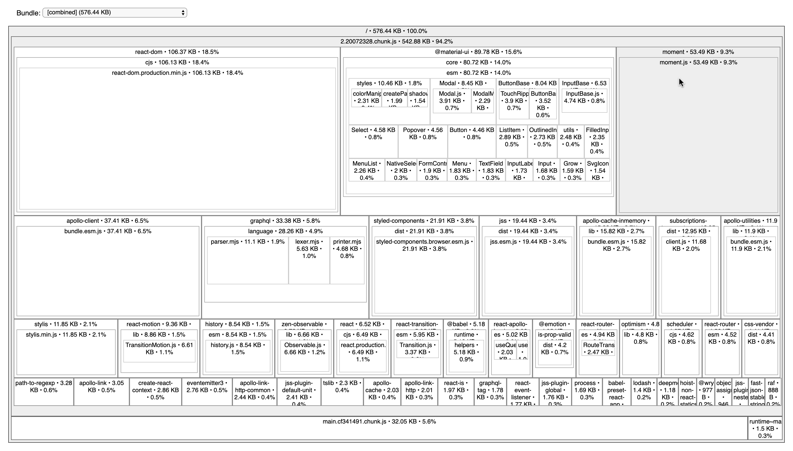

It's interactive so you can dive deeper and deeper into those blocks but in general it shows what libraries and files are included in the produced output with their size(not minified and not gzipped).

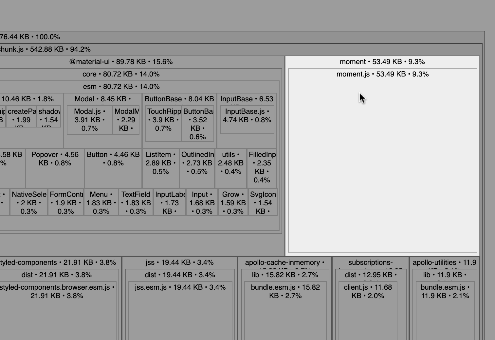

For example, we see that `moment` takes almost _53.49KB_ which is enourmous. In fact we only use its `format` method. The reason is that the library is not well tree-shakable. There are plugins for webpack (or any other build tool) that helps with it but we're going to use an alternative instead. We're going to replace it with `date-fns`.

[{]: <helper> (diffStep "15.15" module="client")

#### [__Client__ Step 15.15: Replace moment with date-fns](https://github.com/Urigo/WhatsApp-Clone-Client-React/commit/cd9e046f74500e62c8dff20748f26a0bc3772f9f)

##### Changed package.json
```diff
@@ -32,12 +32,12 @@
 ┊32┊32┊    "apollo-link-mock": "1.0.1",
 ┊33┊33┊    "apollo-link-ws": "1.0.19",
 ┊34┊34┊    "apollo-utilities": "1.3.3",
+┊  ┊35┊    "date-fns": "2.11.1",
 ┊35┊36┊    "graphql": "14.6.0",
 ┊36┊37┊    "graphql-tag": "2.10.3",
 ┊37┊38┊    "history": "4.10.1",
 ┊38┊39┊    "jest-environment-jsdom-sixteen": "1.0.3",
 ┊39┊40┊    "jest-fetch-mock": "3.0.3",
-┊40┊  ┊    "moment": "2.24.0",
 ┊41┊41┊    "prettier": "2.0.2",
 ┊42┊42┊    "react": "16.13.1",
 ┊43┊43┊    "react-dom": "16.13.1",
```

##### Changed src&#x2F;components&#x2F;ChatRoomScreen&#x2F;MessagesList.tsx
```diff
@@ -1,4 +1,4 @@
-┊1┊ ┊import moment from 'moment';
+┊ ┊1┊import format from 'date-fns/format';
 ┊2┊2┊import React from 'react';
 ┊3┊3┊import { useEffect, useRef } from 'react';
 ┊4┊4┊import styled, { css } from 'styled-components';
```
```diff
@@ -141,7 +141,7 @@
 ┊141┊141┊          key={message.id}>
 ┊142┊142┊          <Contents data-testid="message-content">{message.content}</Contents>
 ┊143┊143┊          <Timestamp data-testid="message-date">
-┊144┊   ┊            {moment(message.createdAt).format('HH:mm')}
+┊   ┊144┊            {format(message.createdAt, 'HH:mm')}
 ┊145┊145┊          </Timestamp>
 ┊146┊146┊        </MessageItem>
 ┊147┊147┊      ))}
```

##### Changed src&#x2F;components&#x2F;ChatsListScreen&#x2F;ChatsList.tsx
```diff
@@ -1,5 +1,5 @@
 ┊1┊1┊import React from 'react';
-┊2┊ ┊import moment from 'moment';
+┊ ┊2┊import format from 'date-fns/format';
 ┊3┊3┊import { List, ListItem } from '@material-ui/core';
 ┊4┊4┊import styled from 'styled-components';
 ┊5┊5┊import { useCallback } from 'react';
```
```diff
@@ -104,7 +104,7 @@
 ┊104┊104┊                    {chat.lastMessage.content}
 ┊105┊105┊                  </MessageContent>
 ┊106┊106┊                  <MessageDate data-testid="date">
-┊107┊   ┊                    {moment(chat.lastMessage.createdAt).format('HH:mm')}
+┊   ┊107┊                    {format(chat.lastMessage.createdAt, 'HH:mm')}
 ┊108┊108┊                  </MessageDate>
 ┊109┊109┊                </React.Fragment>
 ┊110┊110┊              )}
```

[}]: #

Now when you run:

    $ yarn build && yarn size

You should see the following results.

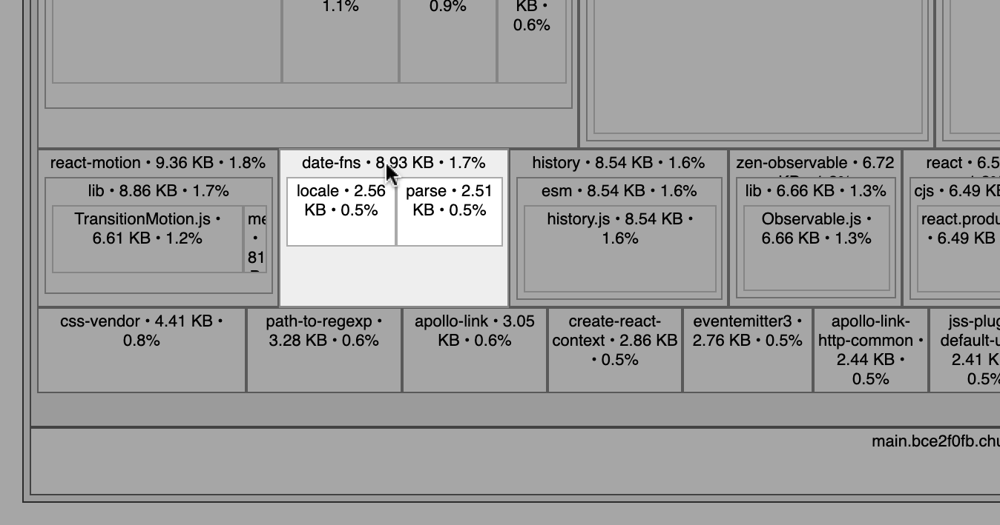

The bundle size is a bit smaller and `date-fns` takes only _8.93KB_ which in comparison to _53.49KB_ is a significant change!

## Load testing

Load testing, in short, is about finding the limit of an application and figure out how to push it even more. We simulate a stressful behavior and apply that to the server until it crashes. We’re trying to answer the question of how the api deals with a pressure.

When to do load testing?
I would say at least before and after major changes, when pre-launching and just from time to time to prevent regressions.

Before doing load testing, we need to prepare a bit first. Right now we use `ts-node` to run the server but it would be faster to run it directly using `node`, just to avoid on-the-fly transpilation of TypeScript files.

In order to do it, we need to define the `outDir` in `tsconfig.json` and add a build step.

[{]: <helper> (diffStep "14.12" module="server")

#### [__Server__ Step 14.12: Produce transpiled code](https://github.com/Urigo/WhatsApp-Clone-Server/commit/511cee18fc54e252096b371da8f8757008671d94)

##### Changed .circleci&#x2F;config.yml
```diff
@@ -18,6 +18,9 @@
 ┊18┊18┊      - run:
 ┊19┊19┊          name: Install Dependencies
 ┊20┊20┊          command: yarn
+┊  ┊21┊      - run:
+┊  ┊22┊          name: Build
+┊  ┊23┊          command: yarn build
 ┊21┊24┊      - run:
 ┊22┊25┊          name: Test
 ┊23┊26┊          command: yarn test
```

##### Changed .gitignore
```diff
@@ -1,3 +1,4 @@
+┊ ┊1┊dist
 ┊1┊2┊node_modules
 ┊2┊3┊npm-debug.log
 ┊3┊4┊test-results/
```

##### Changed modules&#x2F;chats&#x2F;chats.provider.ts
```diff
@@ -145,7 +145,9 @@
 ┊145┊145┊    messages.reverse();
 ┊146┊146┊
 ┊147┊147┊    // cursor is a number representation of created_at
-┊148┊   ┊    const cursor = messages.length ? new Date(messages[0].created_at).getTime() : 0;
+┊   ┊148┊    const cursor = messages.length
+┊   ┊149┊      ? new Date(messages[0].created_at).getTime()
+┊   ┊150┊      : 0;
 ┊149┊151┊    const { rows: next } = await this.db.query(
 ┊150┊152┊      sql`SELECT * FROM messages WHERE chat_id = ${chatId} AND created_at < ${cursorToDate(
 ┊151┊153┊        cursor
```

##### Changed package.json
```diff
@@ -9,6 +9,8 @@
 ┊ 9┊ 9┊  "scripts": {
 ┊10┊10┊    "prestart": "yarn codegen",
 ┊11┊11┊    "start": "ts-node index.ts",
+┊  ┊12┊    "prebuild": "yarn codegen",
+┊  ┊13┊    "build": "tsc",
 ┊12┊14┊    "test": "jest --runInBand --forceExit",
 ┊13┊15┊    "codegen": "graphql-codegen",
 ┊14┊16┊    "format": "prettier \"**/*.ts\" --write"
```

##### Changed tsconfig.json
```diff
@@ -1,5 +1,6 @@
 ┊1┊1┊{
 ┊2┊2┊  "compilerOptions": {
+┊ ┊3┊    "outDir": "dist",
 ┊3┊4┊    "target": "es2020",
 ┊4┊5┊    "module": "commonjs",
 ┊5┊6┊    "skipLibCheck": true,
```

[}]: #

Next, the script to actually run the server:

[{]: <helper> (diffStep "14.13" files="package.json" module="server")

#### [__Server__ Step 14.13: Prepare for production](https://github.com/Urigo/WhatsApp-Clone-Server/commit/1821eb27b429fc86ac245bc294e21ed3b242d2ba)

##### Changed package.json
```diff
@@ -10,6 +10,7 @@
 ┊10┊10┊    "prestart": "yarn codegen",
 ┊11┊11┊    "start": "ts-node index.ts",
 ┊12┊12┊    "prebuild": "yarn codegen",
+┊  ┊13┊    "prod": "node dist/index.js",
 ┊13┊14┊    "build": "tsc",
 ┊14┊15┊    "test": "jest --runInBand --forceExit",
 ┊15┊16┊    "codegen": "graphql-codegen",
```

[}]: #

Once it’s ready, we can move on to tooling.

### Artillery

Artillery is an open-source load testing and functional testing toolkit. It’s API is vast but we will focus on the core part of it which is relevant to this chapter. Artillery is available as a npm package:

    $ yarn add -D artillery

The only step to use Artillery is to set it up. We will create the `artillery.yml` file, like this:

[{]: <helper> (diffStep "14.15" module="server")

#### [__Server__ Step 14.15: Add artillery config](https://github.com/Urigo/WhatsApp-Clone-Server/commit/8f7c819e67c879fd6665e592ae5b0ac98ea2c3ab)

##### Added artillery.yml
```diff
@@ -0,0 +1,72 @@
+┊  ┊ 1┊config:
+┊  ┊ 2┊  target: 'http://localhost:4000/graphql'
+┊  ┊ 3┊  phases:
+┊  ┊ 4┊    - duration: 120
+┊  ┊ 5┊      arrivalRate: 5
+┊  ┊ 6┊      rampTo: 20
+┊  ┊ 7┊scenarios:
+┊  ┊ 8┊  - name: 'Sign in, send a new message and fetch a list of chats'
+┊  ┊ 9┊    flow:
+┊  ┊10┊      - post:
+┊  ┊11┊          url: '/'
+┊  ┊12┊          json:
+┊  ┊13┊            variables:
+┊  ┊14┊              username: 'ray'
+┊  ┊15┊              password: '111'
+┊  ┊16┊            query: |
+┊  ┊17┊              mutation SignIn($username: String!, $password: String!) {
+┊  ┊18┊                signIn(username: $username, password: $password) {
+┊  ┊19┊                  id
+┊  ┊20┊                }
+┊  ┊21┊              }
+┊  ┊22┊      - post:
+┊  ┊23┊          url: '/'
+┊  ┊24┊          json:
+┊  ┊25┊            query: |
+┊  ┊26┊              mutation message {
+┊  ┊27┊                addMessage(chatId: "1", content: "artillery") {
+┊  ┊28┊                  id
+┊  ┊29┊                }
+┊  ┊30┊              }
+┊  ┊31┊      - post:
+┊  ┊32┊          url: '/'
+┊  ┊33┊          json:
+┊  ┊34┊            variables:
+┊  ┊35┊              limit: 20
+┊  ┊36┊            query: |
+┊  ┊37┊              fragment User on User {
+┊  ┊38┊                id
+┊  ┊39┊                name
+┊  ┊40┊                picture
+┊  ┊41┊              }
+┊  ┊42┊              fragment Message on Message {
+┊  ┊43┊                id
+┊  ┊44┊                content
+┊  ┊45┊                chat {
+┊  ┊46┊                  id
+┊  ┊47┊                }
+┊  ┊48┊                sender {
+┊  ┊49┊                  ...User
+┊  ┊50┊                }
+┊  ┊51┊                recipient {
+┊  ┊52┊                  ...User
+┊  ┊53┊                }
+┊  ┊54┊              }
+┊  ┊55┊              query GetChats($limit: Int!) {
+┊  ┊56┊                chats {
+┊  ┊57┊                  id
+┊  ┊58┊                  name
+┊  ┊59┊                  picture
+┊  ┊60┊                  lastMessage {
+┊  ┊61┊                    ...Message
+┊  ┊62┊                  }
+┊  ┊63┊                  messages(limit: $limit) {
+┊  ┊64┊                    messages {
+┊  ┊65┊                      ...Message
+┊  ┊66┊                    }
+┊  ┊67┊                  }
+┊  ┊68┊                  participants {
+┊  ┊69┊                    ...User
+┊  ┊70┊                  }
+┊  ┊71┊                }
+┊  ┊72┊              }
```

[}]: #

As you can see, the config file is built of two sections. First one is named `config` and it defines what’s our target and how the traffic should look like. We used one phase but it could have many. The `duration` parameter is to define how long the phase should take. The `arrivalRate` defines how many virtual users per second are going to hit the target and the `rampTo` directs Artillery to increase this number up to 20, at the middle of the phase.

The next section, called `scenarios`, is all about the actual requests. In our case, we want to authenticate user, submit a new message and fetch an entire list of chats with their messages at the end. Artillery shares cookies between request of the same virtual user, keep that on mind.

We used Ray as the user and fairly similar operations to what the client app sends. That should closely represent the actual usage of the API.

Everything is fine with that config but we need to find the limit, to push even more. That's why we'll also add a second config with a bit more heavier traffic, something to simulate the more real life environment. It's pretty much the same setup except phases. First, we "warms up" the server for 2 minutes, same amount of times goes next with double the traffic, then we keep it for 5 minutes. At the end, we want to crash the server so we send nearly 100 virtual users per second for an entire minute. This way we know when it cracks.

[{]: <helper> (diffStep "14.16" module="server")

#### [__Server__ Step 14.16: Artillery config to find a limit](https://github.com/Urigo/WhatsApp-Clone-Server/commit/7373ab087fd3dd25723720e5295a0daac775b703)

##### Added artillery-limit.yml
```diff
@@ -0,0 +1,77 @@
+┊  ┊ 1┊config:
+┊  ┊ 2┊  target: 'http://localhost:4000/graphql'
+┊  ┊ 3┊  phases:
+┊  ┊ 4┊    - duration: 120
+┊  ┊ 5┊      arrivalRate: 5
+┊  ┊ 6┊    - duration: 120
+┊  ┊ 7┊      arrivalRate: 10
+┊  ┊ 8┊    - duration: 300
+┊  ┊ 9┊      arrivalRate: 10
+┊  ┊10┊    - duration: 60
+┊  ┊11┊      arrivalRate: 100
+┊  ┊12┊scenarios:
+┊  ┊13┊  - name: 'Sign in, send a new message and fetch a list of chats'
+┊  ┊14┊    flow:
+┊  ┊15┊      - post:
+┊  ┊16┊          url: '/'
+┊  ┊17┊          json:
+┊  ┊18┊            variables:
+┊  ┊19┊              username: 'ray'
+┊  ┊20┊              password: '111'
+┊  ┊21┊            query: |
+┊  ┊22┊              mutation SignIn($username: String!, $password: String!) {
+┊  ┊23┊                signIn(username: $username, password: $password) {
+┊  ┊24┊                  id
+┊  ┊25┊                }
+┊  ┊26┊              }
+┊  ┊27┊      - post:
+┊  ┊28┊          url: '/'
+┊  ┊29┊          json:
+┊  ┊30┊            query: |
+┊  ┊31┊              mutation message {
+┊  ┊32┊                addMessage(chatId: "1", content: "artillery") {
+┊  ┊33┊                  id
+┊  ┊34┊                }
+┊  ┊35┊              }
+┊  ┊36┊      - post:
+┊  ┊37┊          url: '/'
+┊  ┊38┊          json:
+┊  ┊39┊            variables:
+┊  ┊40┊              limit: 20
+┊  ┊41┊            query: |
+┊  ┊42┊              fragment User on User {
+┊  ┊43┊                id
+┊  ┊44┊                name
+┊  ┊45┊                picture
+┊  ┊46┊              }
+┊  ┊47┊              fragment Message on Message {
+┊  ┊48┊                id
+┊  ┊49┊                content
+┊  ┊50┊                chat {
+┊  ┊51┊                  id
+┊  ┊52┊                }
+┊  ┊53┊                sender {
+┊  ┊54┊                  ...User
+┊  ┊55┊                }
+┊  ┊56┊                recipient {
+┊  ┊57┊                  ...User
+┊  ┊58┊                }
+┊  ┊59┊              }
+┊  ┊60┊              query GetChats($limit: Int!) {
+┊  ┊61┊                chats {
+┊  ┊62┊                  id
+┊  ┊63┊                  name
+┊  ┊64┊                  picture
+┊  ┊65┊                  lastMessage {
+┊  ┊66┊                    ...Message
+┊  ┊67┊                  }
+┊  ┊68┊                  messages(limit: $limit) {
+┊  ┊69┊                    messages {
+┊  ┊70┊                      ...Message
+┊  ┊71┊                    }
+┊  ┊72┊                  }
+┊  ┊73┊                  participants {
+┊  ┊74┊                    ...User
+┊  ┊75┊                  }
+┊  ┊76┊                }
+┊  ┊77┊              }🚫↵
```

[}]: #

Once everything is ready, let's add npm scripts, one for a normal traffic and a second with the much more users:

[{]: <helper> (diffStep "14.17" module="server")

#### [__Server__ Step 14.17: Add loadtest scripts](https://github.com/Urigo/WhatsApp-Clone-Server/commit/7f3645a27cc92641ee95095fbc13003a34c3c43a)

##### Changed package.json
```diff
@@ -14,7 +14,9 @@
 ┊14┊14┊    "build": "tsc",
 ┊15┊15┊    "test": "jest --runInBand --forceExit",
 ┊16┊16┊    "codegen": "graphql-codegen",
-┊17┊  ┊    "format": "prettier \"**/*.ts\" --write"
+┊  ┊17┊    "format": "prettier \"**/*.ts\" --write",
+┊  ┊18┊    "loadtest": "yarn artillery run artillery.yml > loadtest.log",
+┊  ┊19┊    "loadtest:limit": "yarn artillery run artillery-limit.yml > loadtest.log"
 ┊18┊20┊  },
 ┊19┊21┊  "jest-junit": {
 ┊20┊22┊    "outputDirectory": "./test-results"
```

[}]: #

You probably noticed that we stream the output to the `loadtest.log` file and that's just to read the results in a bit more pleasent way, than in the terminal.

Let’s start the server and run artillery:

    $ yarn build && yarn start
    $ yarn loadtest

You’ll see a loading indicator, might take a while but when it completes, you should see something like this in `loadtest.log` file:

```
Summary report @ 15:00:58(+0200) 2019-05-30
  Scenarios launched:  1506
  Scenarios completed: 1506
  Requests completed:  4518
  RPS sent: 37.35
  Request latency:
    min: 3.5
    max: 115.7
    median: 18.6
    p95: 54.4
    p99: 66.2
  Scenario counts:
    Sign in, send a new message and fetch a list of chats: 1506 (100%)
  Codes:
    200: 4518
```

We ran the scenario 1506 times, all were completed and the total number of requests was 4518.  The **RPS** means requests per second.

The metrics in **Request latency** are in milliseconds. We see what was the shortest request and so on. These **p95** and **p99** values mean that for 95% of virtual users, the latency was 54.4ms or lower, for 99% it was 66.2ms. All requests finished with 200 status code.

You might also automate that process and integrate Artillery CLI with CI/CI systems or even send metrics to external monitoring systems.

### Apollo Engine

Let's bring back the Apollo Engine once again. It will be helpful to analyze the load testing results.

On the **Metrics** page, you will see the following view:

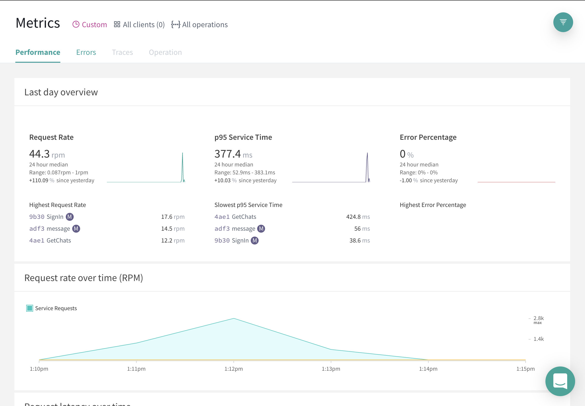

Click on the filter and set a custom date range to match the time you were load testing. Just to filter out other requests.

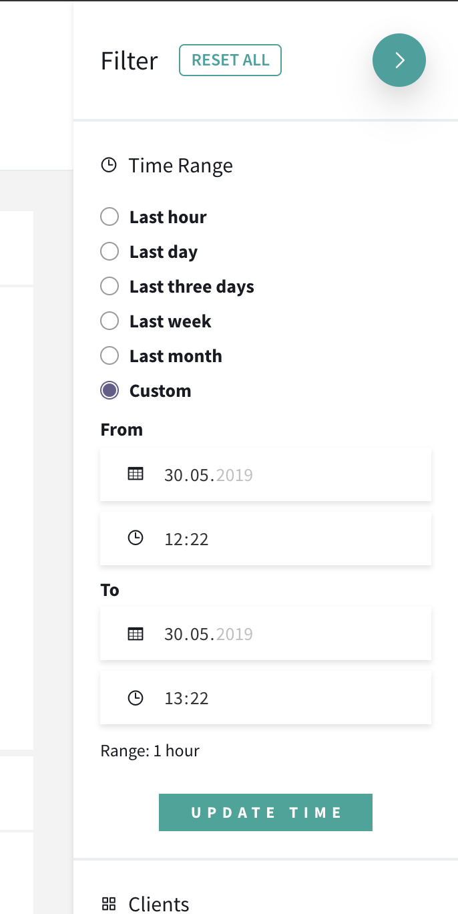

By default, Apollo Engine counts all operations, but you can pick the one you’re interesting in. We don’t do it and inspect them all.

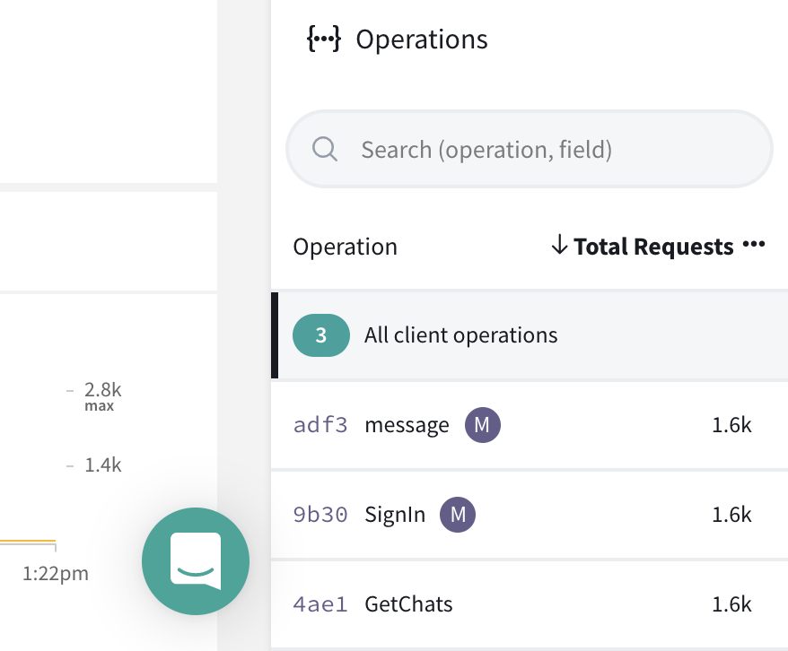

On the main part of the view, you should see “Last day overview” panel.

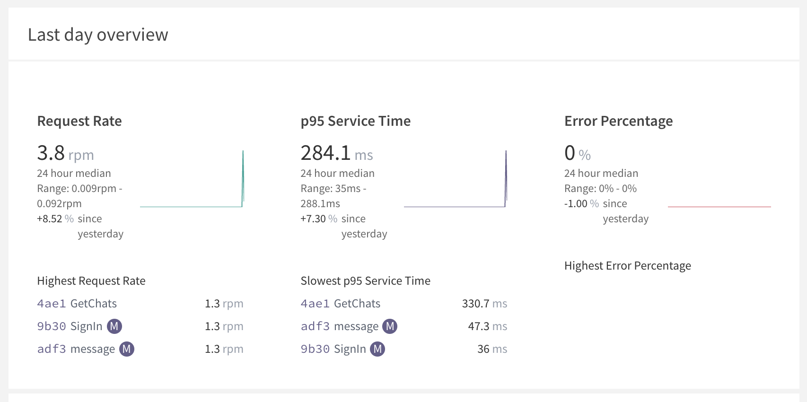

As you can see, all operations we ran are listed there and no error occurred.

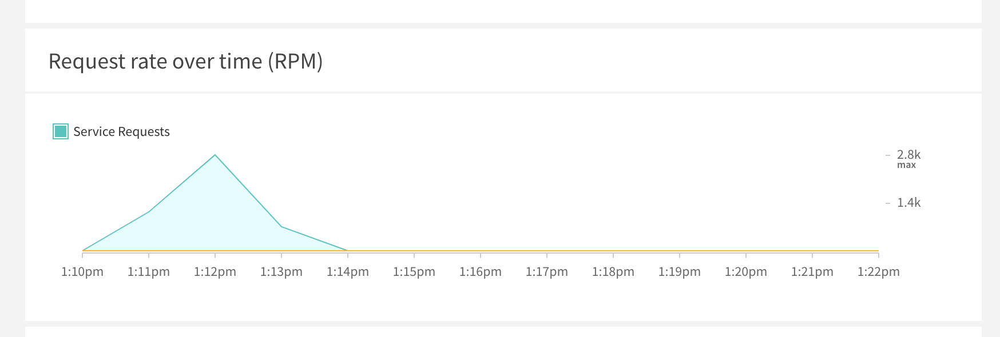

Next section shows the Requests Per Minute (rpm) metric over time. It’s useful to understand which operations are sent more often than others.

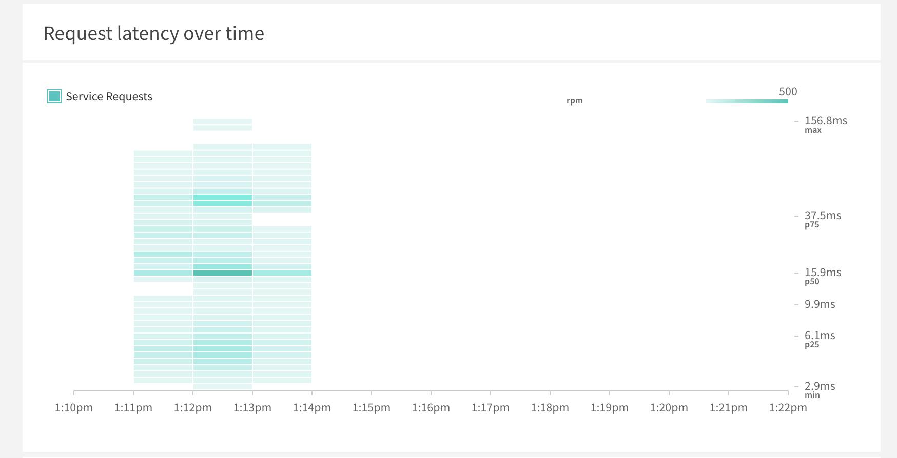
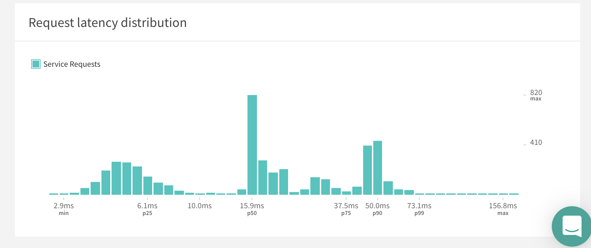

Last two panels are there to understand at what number of requests the latency increases and to show the correlation between them. We see a distribution of the processing time (the horizontal axis) and the number of operations. It also has p50, p75, p90 and p99 marks on it.


[//]: # (foot-start)

[{]: <helper> (navStep)

| [< Previous Step](https://github.com/Urigo/WhatsApp-Clone-Tutorial/tree/master@next/.tortilla/manuals/views/step16.md) |
|:----------------------|

[}]: #
