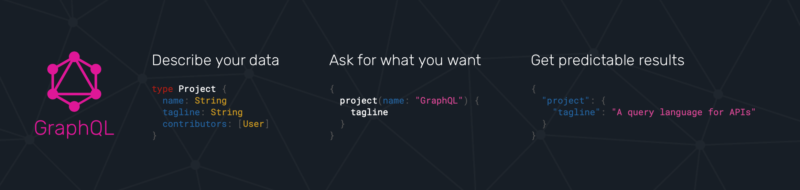
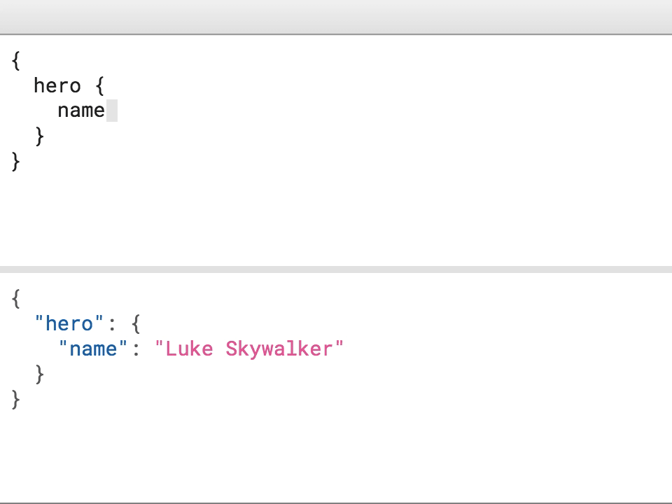
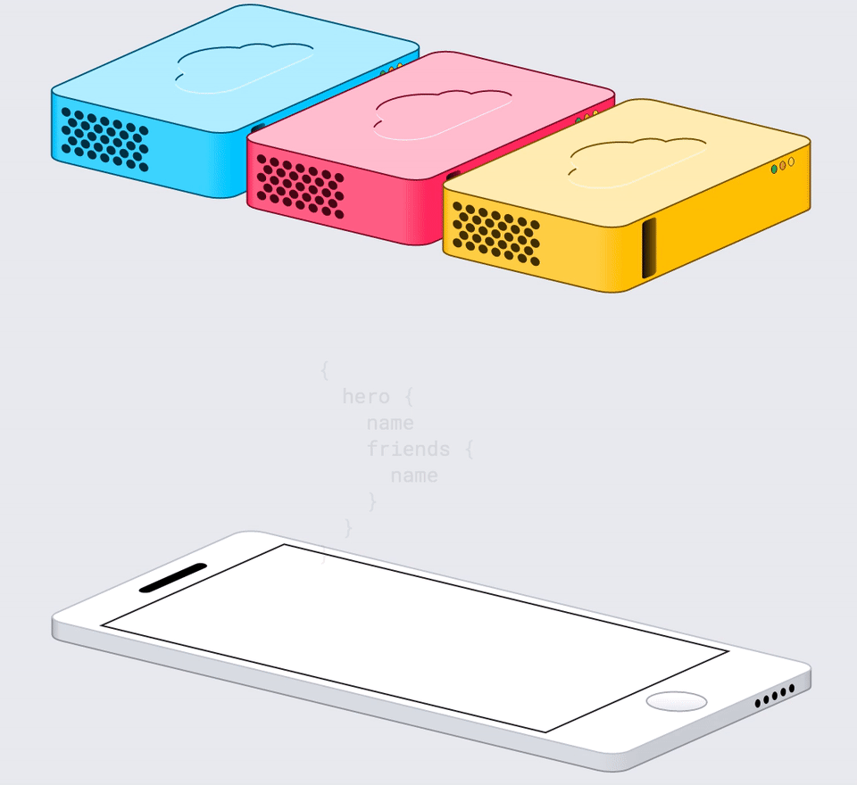
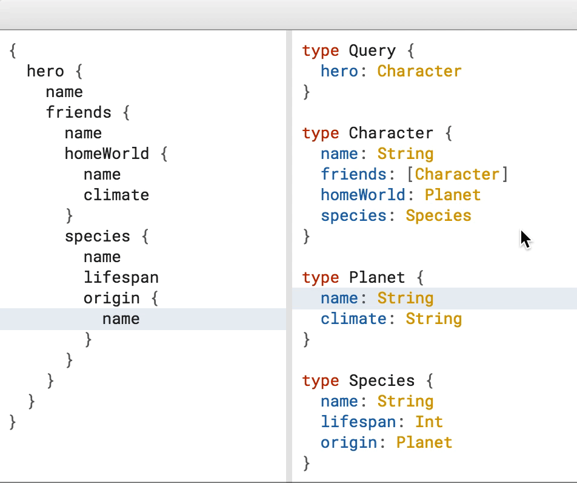
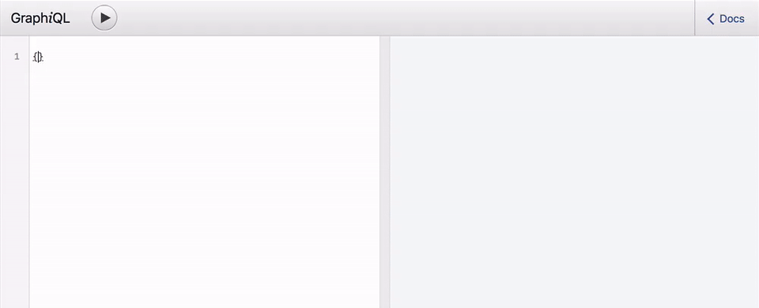
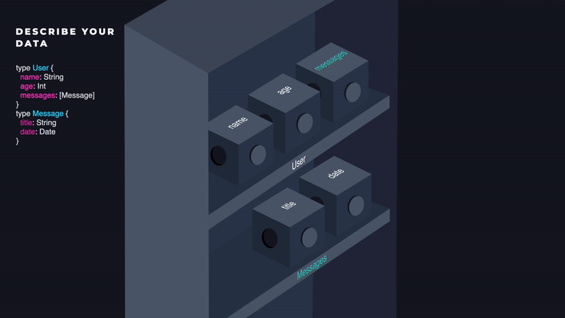
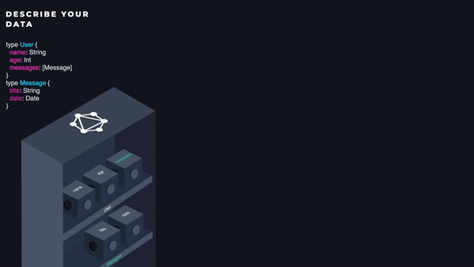

# Step 4: Transition to GraphQL

[//]: # (head-end)


**What is GraphQL?**



[GraphQL](https://graphql.org/) is a query language invented by Facebook, and it's used to query data from a predefined schema.

The schema and query language can describe any data - a file, remote API, database, local storage or all of those combined.

In our case, we will create a schema for the data that our server exposes through its API.
It allows clients to define the structure of the data required, and the exact same structure of data will be returned from the server,
therefore preventing excessively large amounts of data from being returned.

Unlike REST, GraphQL APIs are organized in terms of types and fields, not endpoints.

Even if we use GraphQL without a server,
it can save us a lot of code and work because it can transform data in a very easy way from a schema to a query.



Currently in our app, if we'd like to get its chats, we would send a GET request to `/chats`.
With GraphQL, it would be done differently with a string that describes the data that we would like to get:

```graphql
chats {
  id
  name
  picture
  lastMessage {
    id
    content
    createdAt
  }
}
```

> Above: An illustration of a potential GraphQL query sent to our Whatsapp API

**Why GraphQL and not REST?**

REST has been used for many years and has proven itself to work well, and it's completely agnostic to the implementation of the back-end.
However, when it comes to data projection and aggregation, it fails to deliver.

When using REST, often times you'll find yourself performing multiple requests to execute a single query of data.
Not only that, you might even end up with additional data that is not necessary.
Either way, the process would result in slower and heavier response.

With GraphQL we don’t have that kind of problem -

GraphQL queries access not just the properties of one resource but also smoothly follow references between them.
While typical REST APIs require loading from multiple URLs, GraphQL APIs get all the data your app needs in a single request.
Apps using GraphQL can be quick even on slow mobile network connections.



In GraphQL, the API is based on a schema built from many entities that we call object types.
Think of GraphQL as something similar to TypeScript but for API.
Object types are like interfaces, they describe the shape of an entity.



In TypeScript you would describe a Chat as:

```
interface Chat {
  id: string;
  name: string;
  picture: string;
  lastMessage: Message;
}

interface Message {
  id: string;
  content: string;
  createdAt: number;
}
```

GraphQL:

```
type Chat {
  id: String
  name: String
  picture: String
  lastMessage: Message
}

type Message {
  id: String
  content: String
  createdAt: Float
}
```

Looks pretty similar?

So this is the definition of the available data, now let's see how we can pick and structure data from it using a query:

```graphql
# request
chats {
  id
  name
  picture
  lastMessage {
    id
    content
    createdAt
  }
}
```

We think it’s pretty straightforward to understand what you fetch by just looking at the query above.

If you would execute that query the result might look like this:

```js
// response
{
  chats: [{
    id: “1”,
    name: “Ethan Gonzalez”,
    picture: “https://randomuser.me/api/portraits/thumb/men/1.jpg”,
    lastMessage: {
      id: “1”,
      content: "You on your way?",
      createdAt: 1234567890
  }]
}
```
GraphQL uses types to ensure Apps only ask for what’s possible and provide clear and helpful errors.

You'll get exactly what you asked for with a single request. GraphQL provides a dynamic API while REST doesn't.

GraphQL also saves you a lot of manual code to write.
When calling multiple REST endpoints in order to render a view, you need to:

1. Manually call multiple endpoints
2. Write a code that orchestrates and waits for all the necessary calls to be completed in the most efficient way
3. Combine all the results into a new merged structure of data that you can render

GraphQL runtime is doing all of the above actions automatically for you, just by requiring you to define a schema and a query.

The static schemas and queries enable many more power features which we'll explore later on in the tutorial
like gradually evolving APIs, special data IDEs and more..

One example, with schema introspection you know exactly what data you can request from your API without leaving your editor,
highlight potential issues before sending a query, and take advantage of improved code intelligence.
Here is one example from [GraphiQL](https://github.com/graphql/graphiql) for how GraphQL enable powerful tools from your API’s type system:



Another example is [GraphQL Inspector](https://graphql-inspector.com), which just by looking at your static schema and queries can help you prevent
breaking changes to your API.


**GraphQL schema, in a nutshell**

Like said earlier,  GraphQL APIs are organized in terms of types and fields.
That means that our app data should be described with a schema, where each field gonna have a resolver - the handler that will return the corresponding data.
Things will be much clearer as we move further.

Let's try to describe our app's data with a GraphQL schema and then dive into it:

[{]: <helper> (diffStep "2.2" files="schema/typeDefs.graphql" module="server")

#### [__Server__ Step 2.2: Create a basic GraphQL schema](https://github.com/Urigo/WhatsApp-Clone-Server/commit/dbe89a16f95fdd3f9e1d3589f5a674ab8981e41c)

##### Added schema&#x2F;typeDefs.graphql
```diff
@@ -0,0 +1,19 @@
+┊  ┊ 1┊scalar Date
+┊  ┊ 2┊scalar URL
+┊  ┊ 3┊
+┊  ┊ 4┊type Message {
+┊  ┊ 5┊  id: ID!
+┊  ┊ 6┊  content: String!
+┊  ┊ 7┊  createdAt: Date!
+┊  ┊ 8┊}
+┊  ┊ 9┊
+┊  ┊10┊type Chat {
+┊  ┊11┊  id: ID!
+┊  ┊12┊  name: String!
+┊  ┊13┊  picture: URL
+┊  ┊14┊  lastMessage: Message
+┊  ┊15┊}
+┊  ┊16┊
+┊  ┊17┊type Query {
+┊  ┊18┊  chats: [Chat!]!
+┊  ┊19┊}
```

[}]: #

The schema is self explanatory in terms of what data it's compatible with.

To define a concrete data without any inner schema definition, scalars are used in GraphQL.
For example; `Int`, `Float`, `Date`, `URL` and `EmailAddress`.

The supported built-in scalar types in GraphQL are mostly primitive types:

- Int: Signed 32‐bit integer
- Float: Signed double-precision floating-point value
- String: UTF‐8 character sequence
- Boolean: true or false
- ID (serialized as String): A unique identifier, often used to refetch an object or as the key for a cache.
While serialized as a String, ID signifies that it is not intended to be human‐readable

### Custom Scalars

Any custom scalar can be declared with the `scalar` keyword, and custom types can be declared with the `type` keyword.
Scalars have their own internal validation, parsing and serialization logics.

For example, you can have a custom scalar type `DateTime`.
Due to JSON format restrictions, date objects are passed in string timestamp format or a number in milliseconds.
Instead of having parsing, serialization, and validation logic in our business logic, we can define a `DateTime` scalar and put everything on it.
So, we will have parsed native JavaScript `Date` object in our business logic while it is transferred as string or number like before.

 ***[You can read more about them in that blog post](https://medium.com/the-guild/graphql-scalars-1-0-is-out-more-types-data-integrity-and-strict-validations-on-graphql-972079428fb)***

However, you should know that some types are reserved by GraphQL itself; `Query` is one of them.
The `Query` type will be used as the root for received queries by the clients, which means that we can send queries which start with the `chats` field.
Other reserved types are:

- `type Query` - reserved for [GraphQL queries](https://graphql.org/learn/queries/#mutations).
- `type Mutation` - reserved for [GraphQL mutations.](https://graphql.github.io/learn/queries/)
- `type Subscription` - reserved for [GraphQL subscriptions.](https://www.apollographql.com/docs/react/advanced/subscriptions.html)

> As we're not gonna go through the entire GraphQL API, it's recommended to go through the [official learn section of the GraphQL website](https://graphql.org/learn/), but the information so far will definitely help you kick-start, plus the upcoming implementation.

**Getting started**

We will be implementing a GraphQL mechanism for the client and for the server.
We will start with the server as things will make more sense, and we will be able to test it before we proceed into the client.
Essentially GraphQL is connected into an HTTP endpoint, usually under `POST /graphql`, and so this is exactly what we're gonna do, connect the endpoint handler.
Luckily, we don't have to implement that. A team called [Apollo](https://www.apollographql.com/) already did it for us so that we can use their implementation.
We will install the required packages:

    $ yarn add apollo-server-express graphql
    $ yarn add --dev @types/graphql

- [`graphql`](https://www.npmjs.com/package/graphql) - The core package of GraphQL that includes the resolvers for basic data-types.
- [`apollo-server-express`](https://www.npmjs.com/package/apollo-server-express) - Apollo's implementation for the GraphQL Express REST endpoint.
- `@types/graphql` - TypeScript definitions. Notice that we didn't need to install Apollo's types library. That is because Apollo themselves writes their source code in Typescript so
we get a ready Typescript code directly from their library.

We can now connect Apollo's middleware under the `/graphql` route:

[{]: <helper> (diffStep "2.1" files="index.ts" module="server")

#### [__Server__ Step 2.1: Setup Apollo GraphQL](https://github.com/Urigo/WhatsApp-Clone-Server/commit/383f1dc5a58bfb85b3562ae2b1bf4a3d9a2295d7)

##### Changed index.ts
```diff
@@ -1,10 +1,13 @@
+┊  ┊ 1┊import { ApolloServer, gql } from 'apollo-server-express';
 ┊ 1┊ 2┊import cors from 'cors';
 ┊ 2┊ 3┊import express from 'express';
 ┊ 3┊ 4┊import { chats } from './db';
+┊  ┊ 5┊import schema from './schema';
 ┊ 4┊ 6┊
 ┊ 5┊ 7┊const app = express();
 ┊ 6┊ 8┊
 ┊ 7┊ 9┊app.use(cors());
+┊  ┊10┊app.use(express.json());
 ┊ 8┊11┊
 ┊ 9┊12┊app.get('/_ping', (req, res) => {
 ┊10┊13┊  res.send('pong');
```
```diff
@@ -14,6 +17,13 @@
 ┊14┊17┊  res.json(chats);
 ┊15┊18┊});
 ┊16┊19┊
+┊  ┊20┊const server = new ApolloServer({ schema });
+┊  ┊21┊
+┊  ┊22┊server.applyMiddleware({
+┊  ┊23┊  app,
+┊  ┊24┊  path: '/graphql',
+┊  ┊25┊});
+┊  ┊26┊
 ┊17┊27┊const port = process.env.PORT || 4000;
 ┊18┊28┊
 ┊19┊29┊app.listen(port, () => {
```

[}]: #

As you can see, the middleware requires a schema. A schema is composed mainly out of 2 fields:

- `typeDefs` (type definitions) - the schema types we wrote earlier this chapter for chats.
- `resolvers` - Functions that will provide the data for each field in `typeDefs`.

You can think about our resolver functions as boxes on the shelf which we prepare for later, when GraphQL will execute them
and for the schema as the label that describe those functions:


We will start first by defining the types.
All we have to do is to copy-paste the contents of the schema that was shown earlier into a new file called `typeDefs.graphql`:

[{]: <helper> (diffStep "2.2" files="schema/typeDefs.graphql" module="server")

#### [__Server__ Step 2.2: Create a basic GraphQL schema](https://github.com/Urigo/WhatsApp-Clone-Server/commit/dbe89a16f95fdd3f9e1d3589f5a674ab8981e41c)

##### Added schema&#x2F;typeDefs.graphql
```diff
@@ -0,0 +1,19 @@
+┊  ┊ 1┊scalar Date
+┊  ┊ 2┊scalar URL
+┊  ┊ 3┊
+┊  ┊ 4┊type Message {
+┊  ┊ 5┊  id: ID!
+┊  ┊ 6┊  content: String!
+┊  ┊ 7┊  createdAt: Date!
+┊  ┊ 8┊}
+┊  ┊ 9┊
+┊  ┊10┊type Chat {
+┊  ┊11┊  id: ID!
+┊  ┊12┊  name: String!
+┊  ┊13┊  picture: URL
+┊  ┊14┊  lastMessage: Message
+┊  ┊15┊}
+┊  ┊16┊
+┊  ┊17┊type Query {
+┊  ┊18┊  chats: [Chat!]!
+┊  ┊19┊}
```

[}]: #

> The `.graphql` file extension is just a more convenient way to work with a GraphQL schema.
> The exported result should be a simple string that we can use to compose our GraphQL schema.
> The clear advantage of working with a dedicated file is that we get to have syntax highlight.

Note that some of the fields have exclamation mark at the end and it means that the field is non-nullable,
meaning that the GraphQL service promises to always give you a value when you query this field.

Chats Query is even more interesting case with two exclamation marks `[Chat!]!`.

The outer exclamation mark means that if you run this query it will always return an array of zero or more items (never null)
and inner exclamation mark means that every item of returned array will be of type `Chat` and never be null.

Now we will implement the resolvers. Resolvers functions, presented in a JSON object, that correspond to each field in the GraphQL schema.
Each resolver name should match the field name it represents.
It will accept as a parameter the parent resolver value (we'll explain that process in a second),
can run any logic, like calling a server, and returns a value that correspond to the type it has in the schema:



You can read more about resolvers in [Apollo's official docs for resolvers](https://www.apollographql.com/docs/tutorial/resolvers.html).

This is how our resolvers should look like:

[{]: <helper> (diffStep "2.2" files="schema/resolvers.ts" module="server")

#### [__Server__ Step 2.2: Create a basic GraphQL schema](https://github.com/Urigo/WhatsApp-Clone-Server/commit/dbe89a16f95fdd3f9e1d3589f5a674ab8981e41c)

##### Added schema&#x2F;resolvers.ts
```diff
@@ -0,0 +1,15 @@
+┊  ┊ 1┊import { DateTimeResolver, URLResolver } from 'graphql-scalars';
+┊  ┊ 2┊import { chats } from '../db';
+┊  ┊ 3┊
+┊  ┊ 4┊const resolvers = {
+┊  ┊ 5┊  Date: DateTimeResolver,
+┊  ┊ 6┊  URL: URLResolver,
+┊  ┊ 7┊
+┊  ┊ 8┊  Query: {
+┊  ┊ 9┊    chats() {
+┊  ┊10┊      return chats;
+┊  ┊11┊    },
+┊  ┊12┊  },
+┊  ┊13┊};
+┊  ┊14┊
+┊  ┊15┊export default resolvers;
```

[}]: #

For now it's extremely simple, we map the chats query directly into the database collection.
Each field in the resolvers object should match the GraphQL type it represents in the schema, But in our case, we've just implemented `chats`.

That's because the GraphQL engine we are using (graphql.js), knows how to understand json structure and our chats object is already structured like our schema.

Later on we'll add resolvers of more fields because we'll need more logic the get the right response.

Note that we've implemented a custom scalar named `Date` and `URL` but we will need an implementation for it.
We will use [`graphql-scalars`](https://github.com/urigo/graphql-scalars) that has many custom scalars ready-to-use.

Let's install it:

    $ yarn add graphql-scalars

Final thing that we have to do would be combining the resolvers and the type-defs under a single GraphQL schema.

[{]: <helper> (diffStep "2.2" files="index.ts" module="server")

#### [__Server__ Step 2.2: Create a basic GraphQL schema](https://github.com/Urigo/WhatsApp-Clone-Server/commit/dbe89a16f95fdd3f9e1d3589f5a674ab8981e41c)

##### Added schema&#x2F;index.ts
```diff
@@ -0,0 +1,7 @@
+┊ ┊1┊import { importSchema } from 'graphql-import';
+┊ ┊2┊import { makeExecutableSchema } from 'graphql-tools';
+┊ ┊3┊import resolvers from './resolvers';
+┊ ┊4┊
+┊ ┊5┊const typeDefs = importSchema('schema/typeDefs.graphql');
+┊ ┊6┊
+┊ ┊7┊export default makeExecutableSchema({ resolvers, typeDefs });
```

[}]: #

[`graphql-tools`](https://www.npmjs.com/package/graphql-tools) is a library with a set of utilities that will help us create a schema that will be compatible with Apollo's API:

    $ yarn add graphql-tools graphql-import

There's one optimization however, that we should make in our DB.
Right now, each chat document has a direct reference to a message via the `lastMessage` field.
Practically speaking, this is NOT how the data sits in the DB.
The `lastMessage` should only holds the ID for the correlated message, and then in the Node.JS app,
we should **resolve** it according to our needs. Let's make the appropriate changes in the resolver of the `lastMessage` field:

[{]: <helper> (diffStep "2.3" files="schema/resolvers.ts" module="server")

#### [__Server__ Step 2.3: Resolve Chat.lastMessage](https://github.com/Urigo/WhatsApp-Clone-Server/commit/1164c838420e4c7ce9f9adb9f7af937d0c3fec21)

##### Changed schema&#x2F;resolvers.ts
```diff
@@ -1,10 +1,16 @@
 ┊ 1┊ 1┊import { DateTimeResolver, URLResolver } from 'graphql-scalars';
-┊ 2┊  ┊import { chats } from '../db';
+┊  ┊ 2┊import { chats, messages } from '../db';
 ┊ 3┊ 3┊
 ┊ 4┊ 4┊const resolvers = {
 ┊ 5┊ 5┊  Date: DateTimeResolver,
 ┊ 6┊ 6┊  URL: URLResolver,
 ┊ 7┊ 7┊
+┊  ┊ 8┊  Chat: {
+┊  ┊ 9┊    lastMessage(chat: any) {
+┊  ┊10┊      return messages.find(m => m.id === chat.lastMessage);
+┊  ┊11┊    },
+┊  ┊12┊  },
+┊  ┊13┊
 ┊ 8┊14┊  Query: {
 ┊ 9┊15┊    chats() {
 ┊10┊16┊      return chats;
```

[}]: #

The first argument of the resolver is the raw chat data received by the parent of that resolver field (`chats` resolver),
and the returned result should be the mapped value which we would like to return to the client.



In our case, the `lastMessage` resolver would be executed by the GraphQL engine with the return value of the `chats` resolver.

As we get further in this tutorial we should get a better grasp regards resolvers and their API, since we will have to deal with more logic and complexity within our Node.JS app.

Assuming that the server is running, we can already test our GraphQL endpoint.
Because it's exposed to us via a REST endpoint, we can use a `$ curl` command to send a request to `GET localhost:4000/graphql` and get a response with all the data.
Again, the query that we're gonna use to fetch the chats is:

```graphql
chats {
  id
  name
  picture
  lastMessage {
    id
    content
    createdAt
  }
}
```

The one-liner version of it with a `$ curl` command looks like so:

    curl \
      -X POST \
      -H "Content-Type: application/json" \
      --data '{ "query": "{ chats { id name picture lastMessage { id content createdAt } } }" }' \
      localhost:4000/graphql

As a response we should get the data-mock for our chats stored in the server. Since we have that in place, we can go ahead and delete our implementation for the `GET /chats` route.

[{]: <helper> (diffStep "2.4" module="server")

#### [__Server__ Step 2.4: Remove GET /chats route](https://github.com/Urigo/WhatsApp-Clone-Server/commit/e5cbd789475dd13ae3e06dc7183324fc9a0149a3)

##### Changed index.ts
```diff
@@ -1,7 +1,6 @@
 ┊1┊1┊import { ApolloServer, gql } from 'apollo-server-express';
 ┊2┊2┊import cors from 'cors';
 ┊3┊3┊import express from 'express';
-┊4┊ ┊import { chats } from './db';
 ┊5┊4┊import schema from './schema';
 ┊6┊5┊
 ┊7┊6┊const app = express();
```
```diff
@@ -13,10 +12,6 @@
 ┊13┊12┊  res.send('pong');
 ┊14┊13┊});
 ┊15┊14┊
-┊16┊  ┊app.get('/chats', (req, res) => {
-┊17┊  ┊  res.json(chats);
-┊18┊  ┊});
-┊19┊  ┊
 ┊20┊15┊const server = new ApolloServer({ schema });
 ┊21┊16┊
 ┊22┊17┊server.applyMiddleware({
```

[}]: #

Another way to test and inspect our GraphQL schema would be by using an IDE for the browser called [GraphQL Playground](https://github.com/prisma/graphql-playground).
Apollo-Server ships with it right out of the box and can be used right away by navigating to the `http://localhost:4000/graphql` URL from the browser.

[](https://graphqlbin.com/v2/6RQ6TM)


So getting back to the client, all we have to do is to change the fetching URL in the ChatsList component to use our newly implemented GraphQL REST endpoint:

[{]: <helper> (diffStep "4.1" module="client")

#### [__Client__ Step 4.1: Replace REST call with GraphQL call](https://github.com/Urigo/WhatsApp-Clone-Client-React/commit/03676278460aae1bc4592a906287f394313f928a)

##### Changed src&#x2F;components&#x2F;ChatsListScreen&#x2F;ChatsList.tsx
```diff
@@ -56,12 +56,35 @@
 ┊56┊56┊  font-size: 13px;
 ┊57┊57┊`;
 ┊58┊58┊
+┊  ┊59┊const getChatsQuery = `
+┊  ┊60┊  query GetChats {
+┊  ┊61┊    chats {
+┊  ┊62┊      id
+┊  ┊63┊      name
+┊  ┊64┊      picture
+┊  ┊65┊      lastMessage {
+┊  ┊66┊        id
+┊  ┊67┊        content
+┊  ┊68┊        createdAt
+┊  ┊69┊      }
+┊  ┊70┊    }
+┊  ┊71┊  }
+┊  ┊72┊`;
+┊  ┊73┊
 ┊59┊74┊const ChatsList = () => {
 ┊60┊75┊  const [chats, setChats] = useState<any[]>([]);
 ┊61┊76┊
 ┊62┊77┊  useMemo(async () => {
-┊63┊  ┊    const body = await fetch(`${process.env.REACT_APP_SERVER_URL}/chats`);
-┊64┊  ┊    const chats = await body.json();
+┊  ┊78┊    const body = await fetch(`${process.env.REACT_APP_SERVER_URL}/graphql`, {
+┊  ┊79┊      method: 'POST',
+┊  ┊80┊      headers: {
+┊  ┊81┊        'Content-Type': 'application/json',
+┊  ┊82┊      },
+┊  ┊83┊      body: JSON.stringify({ query: getChatsQuery }),
+┊  ┊84┊    });
+┊  ┊85┊    const {
+┊  ┊86┊      data: { chats },
+┊  ┊87┊    } = await body.json();
 ┊65┊88┊    setChats(chats);
 ┊66┊89┊  }, []);
```

[}]: #

The received data should be similar to the previous one.
No further changes are required.

In the next chapter, we will learn how to test the React.Components in the client, and Apollo-GraphQL resolvers in the server.

-------
TODO: Start with calling the  `graphql` function just on the server to show how it works.
TODO: Example middlewares in Node
TODO: Mention the vs code extension

TODO: Start without Apollo and add it later, in the same file.

TODO: Why adding headers? and go through the code

TODO: Talk about working with document node and not with makeExacutableSchema
```
זה לא משנה בתכלס, כי ApolloServer בכל מקרה יעשה לזה קימפול
הנקודה היא שלא צריך לקמפל פעמיים לGraphQLSchema
פשוט עדיף שאת הקימפול יעשה הרכיב האחרון שהולך להשתמש בtypeDefs

DocumentNode => DocumentNode (cheap, easy, no checks)
DocumentNode => GraphQLSchema (compile AST, does all checking, might throw exceptions, expensive)
GraphQLSchema => DocumentNode (printed version, might lost AST features such as directives)
```

[//]: # (foot-start)

[{]: <helper> (navStep)

| [< Previous Step](https://github.com/Urigo/WhatsApp-Clone-Tutorial/tree/master@next/.tortilla/manuals/views/step3.md) | [Next Step >](https://github.com/Urigo/WhatsApp-Clone-Tutorial/tree/master@next/.tortilla/manuals/views/step5.md) |
|:--------------------------------|--------------------------------:|

[}]: #
